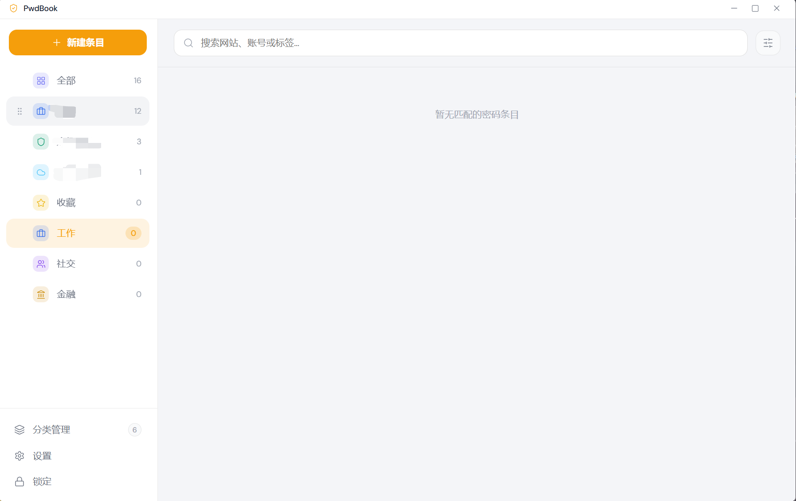
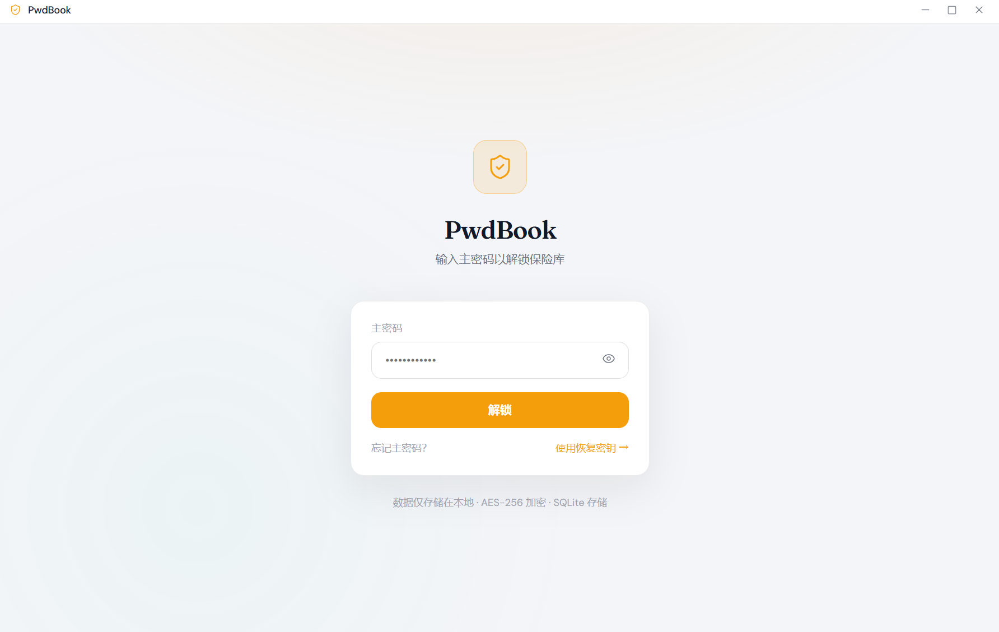
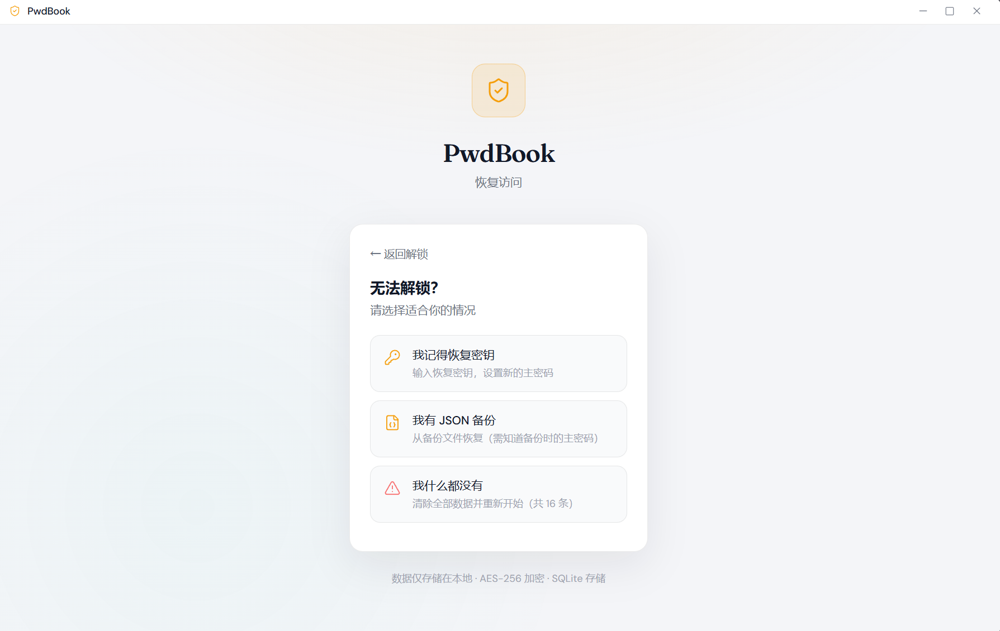
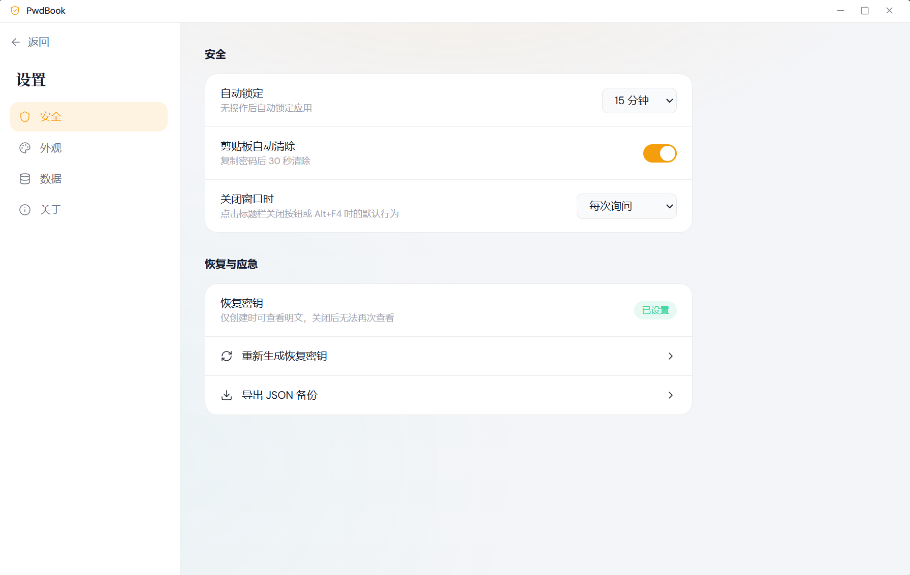
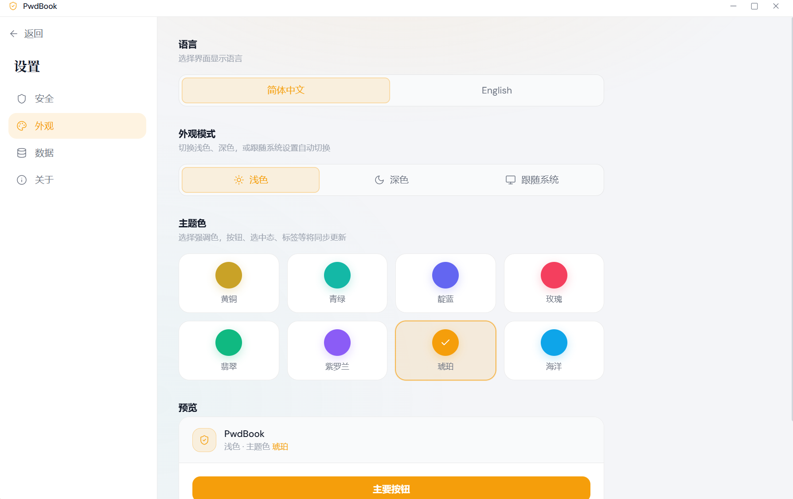
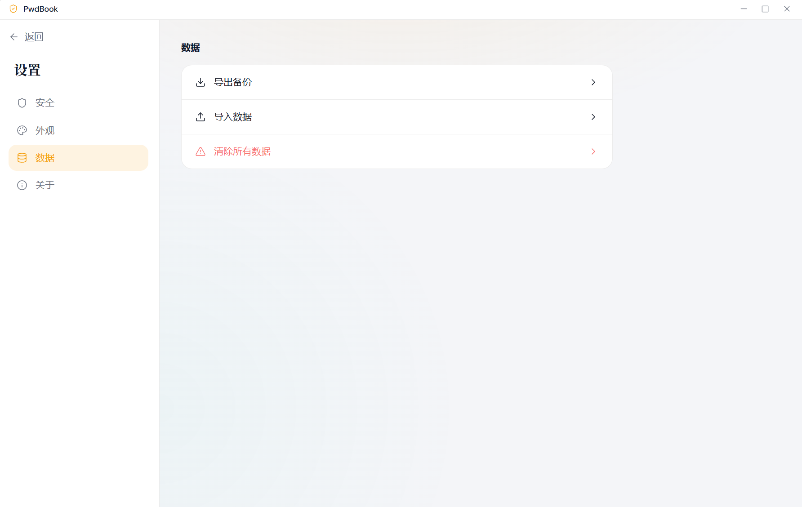
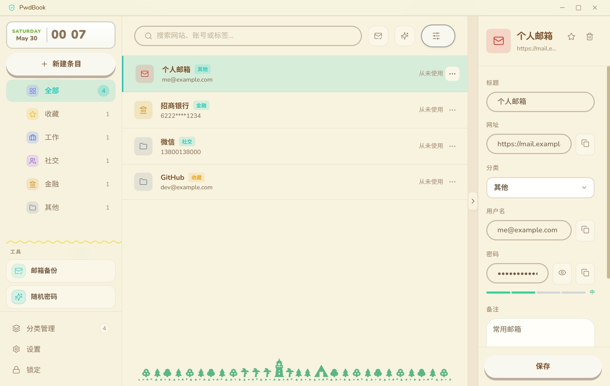
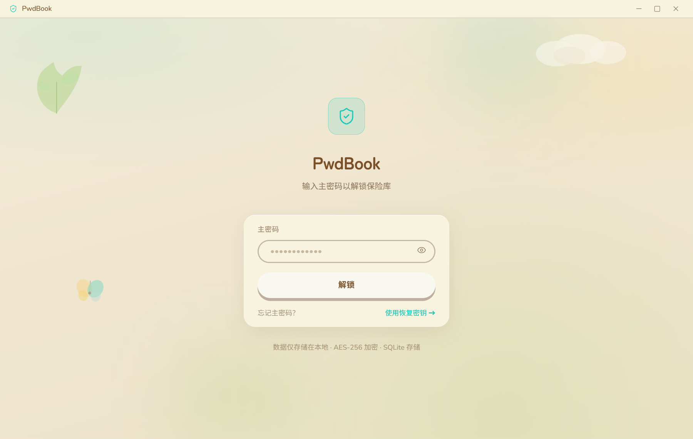
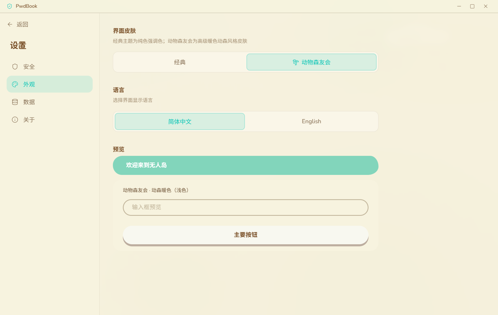

<div align="center">

# PwdBook

### 密码散落各处、记不住主密码、又不愿把数据交给云端？PwdBook 把保险库留在你的电脑上。


[概览](#概览) · [产品截图](#产品截图) · [功能](#功能) · [版本更新](#版本更新) · [快速开始](#快速开始) · [安全模型](#安全模型) · [项目结构](#项目结构) · [文档](#文档) · [常见问题](#常见问题)

</div>

---

> [!IMPORTANT]
> **本地优先，默认不上网。** 保险库数据仅存本机 `%APPDATA%/PwdBook/pwdbook.db`（Windows）或 Electron `userData` 目录；无遥测、无厂商托管云同步。
>
> **可选同步（v1.9.0 局域网 / v1.19.0 文件夹）** — Wi-Fi 同步仅在同一局域网内传输**主密码加密的同步包**；文件夹同步将相同格式的 `vault.pwdbook` 写入本地或云盘目录（Dropbox、OneDrive 等），由云盘传播、本机加解密。均不经 PwdBook 厂商云。见 [同步](#同步-v1190)。
>
> **可选邮箱备份** 会在你主动配置 SMTP 并发送时，向指定邮件服务器建立出站连接；备份内容为 AES-256 加密 ZIP，解压密码为主密码。
>
> **卸载：** NSIS 安装程序卸载时可选择是否删除本地密码数据（见 `deps/installer.nsh`）；应用内「清除所有数据」会 wipe 本地库。

```bash
git clone <your-repo-url>
cd pwd-book
npm install
npm run dev
```

---

## 概览

**PwdBook** 是一款 **Electron + Vue 3 + TypeScript** 桌面密码库。所有条目保存在本机 SQLite 数据库中，通过主密码解锁；解锁后的会话密钥用于加密各条目的密码字段，锁定或退出后内存中的会话密钥会被清除。

若你用过 KeePass、Bitwarden 离线库或 1Password 本地 vault，核心思路相同：**主密码 + 本地加密存储**。PwdBook 的差异在于开箱即用的桌面体验、恢复密钥流程，以及可选的加密邮箱灾备。

应用提供「数字保险库」与 **Animal Island** 两套视觉皮肤，标题栏可**快捷换肤**；**v1.20.0** 主窗口标题栏支持 **窗口置顶** 图钉；**v1.21.0** **设置 → 安全** 支持 **开机自动启动**（默认关闭；**v1.23.0** 修复 Windows 含空格安装路径）；**v1.22.0** 条目支持 **附件**、**自定义字段** 与 **列表/方块** 布局切换；**v1.23.0** 托盘菜单可直达 **设置**、数据库损坏时自动隔离备份并创建空库；**v1.24.0** 标题栏 **产品学习** 提供 6 条交互式引导路径；**v1.25.0** 侧栏底部改为 **工具箱 / 管理 / 回收站 / 设置** 图标栏，**标签筛选** 迁至列表工具栏；支持中英文界面；默认窗口 1200×760，自定义标题栏。官方打包支持 **Windows**（NSIS）与 **macOS**（DMG，x64 / arm64）。

<p align="center">
  
</p>
<p align="center"><em>主界面 — 分类导航、搜索与密码条目管理</em></p>

| 维度 | 说明 |
|------|------|
| 数据位置 | `%APPDATA%/PwdBook/pwdbook.db`（Windows）或 Electron `userData` 目录 |
| 加密 | 主密码 scrypt 校验；条目密码 AES-256-GCM |
| 进程模型 | 主进程（业务与加密）+ Preload 桥 + Vue 渲染进程 |
| 官方打包 | **Windows**（NSIS）· **macOS**（DMG，v1.10.0 起） |

## 产品截图

### 锁定与恢复

<p align="center">
  
</p>
<p align="center"><em>锁定页 — 主密码解锁；支持恢复密钥入口</em></p>

<p align="center">
  
</p>
<p align="center"><em>恢复访问 — 用恢复密钥重置主密码，或清除后重建</em></p>

### 设置

<table>
  <tr>
    <td width="50%" align="center">
      
      <br /><sub>安全 — 开机自动启动、自动锁定、剪贴板清除、关闭窗口行为、恢复密钥</sub>
    </td>
    <td width="50%" align="center">
      
      <br /><sub>外观 — 中英文、经典/Animal Island 皮肤、浅色/深色/跟随系统、八种强调色</sub>
    </td>
  </tr>
  <tr>
    <td colspan="2" align="center">
      
      <br /><sub>数据 — 导出/导入向导（JSON、CSV、Excel 及第三方 CSV）、清除全部数据</sub>
    </td>
  </tr>
</table>

### Animal Island 皮肤

治愈系 **Animal Island** 主题（基于 [animal-island-vue](https://www.npmjs.com/package/animal-island-vue)），与经典「数字保险库」皮肤可一键切换。

<p align="center">
  
</p>
<p align="center"><em>主界面 — 柔和配色、圆角卡片与装饰背景</em></p>

<table>
  <tr>
    <td width="50%" align="center">
      
      <br /><sub>锁定页 — 主密码解锁</sub>
    </td>
    <td width="50%" align="center">
      
      <br /><sub>外观 — 皮肤切换与组件预览</sub>
    </td>
  </tr>
  <tr>
    <td width="50%" align="center">
      
      <br /><sub>随机密码 — 长度与字符集配置</sub>
    </td>
    <td width="50%" align="center">
      
      <br /><sub>邮箱备份 — SMTP 配置与加密 ZIP 发送</sub>
    </td>
  </tr>
</table>

## 功能

功能索引：[保险库](#保险库与条目) · [设置](#设置) · [锁定与恢复](#主密码锁定与恢复) · [工具](#工具) · [导入导出](#数据导入导出) · [同步](#同步-v1190) · [外观](#外观) · [产品引导](#产品引导-v1240) · [浏览器扩展](#浏览器扩展chrome--edge) · [系统集成](#窗口与系统集成windows)

以下按用户可见模块整理；实现细节见 [docs/code-map](./docs/code-map/README.md)。

### 保险库与条目

主界面为 **保险库**（`VaultView`）：左侧分类/标签导航，中间条目列表，右侧详情侧栏。

| 能力 | 说明 |
|------|------|
| **分类** | 内置「全部」「收藏」与自定义分类；侧栏 **按住拖动** 排序（**v1.17.0**：移除左侧把手，纵向 ≥15px 才进入拖拽；顺序持久化）；**v1.18.0** 切换分类时 **不自动选中条目**，需手动点击列表项；搜索框旁 **「+」** 快速新建；**分类管理**面板内联改名、点图标更换（**v1.11.0**：60 图形 + A–Z 字母，双 Tab 选择器）；**自定义分类右键**可编辑、删除（仅空分类可删，二次确认弹窗；**v1.25.0** 成功/失败 Toast）；创建成功后自动关闭管理弹窗；**v1.14.0** 侧栏右缘可 **收起** 至窄条（**v1.17.0** 圆形描边折叠钮；状态写入 `localStorage`，空间不足时自动收起） |
| **标签** | 侧栏底部 **管理** 图标 → **标签管理**：新建、重命名、删除（同步更新所有关联条目）；详情页从已有标签选用，支持搜索与条目数统计；**v1.12.0** **按标签筛选**（搜索 + 多选 AND）；**v1.25.0** 筛选入口迁至 **列表工具栏 # 按钮**（popover） |
| **浏览** | 「全部」/「收藏」筛选；搜索标题、用户名、网址、分类、标签、**备注**与**自定义字段**（**v1.12.0** 备注；**v1.22.0** 自定义字段；支持**拼音首字母**，如 `cs` 匹配「测试」；支持一键清除，命中时高亮原文子串）；默认按 **标题 A–Z** 排序，可切换 **最近使用** / **创建时间**（「最近使用」依赖 `last_used_at`，在打开网址或启动本地程序时更新）；**v1.22.0** 列表区可切换 **列表 / 方块** 布局（写入 `localStorage`） |
| **条目字段** | 标题、网址、用户名、密码、备注、标签、**显示图标**、所属分类、**本地程序路径**（可选）、**TOTP 两步验证密钥**（**v1.12.0**，选填；实时 6 位验证码，30 秒刷新，可复制；**v1.13.0** 起编辑时可显示/隐藏密钥）、**自定义字段**（**v1.22.0**，name/value，每条条目最多 20 个）、**附件**（**v1.22.0**，加密存于本地，每条条目最多 10 个、单文件 ≤ 5 MB；可打开、另存为、删除） |
| **收藏** | 列表星标与详情/右键菜单可切换；「收藏」分类仅展示已收藏条目 |
| **详情侧栏** | 选中条目或「新建条目」时自动展开；**已有条目默认只读**，点「编辑」后修改；左缘可收起（`pwdbook-detail-collapsed` 写入 `localStorage`）；拖拽调整宽度；各字段旁可复制；新建时可一键生成密码，取消创建会收起侧栏；**v1.14.0** 标题栏 **在新窗口打开** 可将详情弹出为独立小窗口（主窗口列表区扩展占满原详情位，主/小窗口切换选中条目双向同步；小窗口标题栏支持 **窗口置顶**；锁定保险库时自动关闭小窗口）；**v1.20.0** 主窗口标题栏亦支持 **窗口置顶** 图钉 |
| **列表菜单** | 右键或「⋯」：**复制到剪贴板**（多行结构化文本，含标题/网址/用户名/密码/备注/标签/收藏等）、**创建副本**（标题追加 ` - 副本` / ` - Copy`）、**删除**（移至回收站，应用内确认弹窗）、**移动到其他分类**（子菜单最多展示 5 个分类并可滚动）、加入/取消收藏、**打开网址**、**打开程序**（已填路径时）；右键时同步选中并高亮 |
| **回收站** | 侧栏底部 **回收站** 图标（有条目时显示角标）；删除的条目保留可配置天数（**设置 → 安全 → 回收站保留期限**，默认 30 天），过期自动彻底删除；支持单条/全部还原、单条/清空彻底删除 |
| **侧栏底部栏**（**v1.25.0**） | 四图标：**工具箱**（随机密码、密码健康）、**管理**（分类/标签）、**回收站**、**设置**；悬停显示名称，工具箱与管理弹出子菜单；锁定改由标题栏快捷入口 |

**复制到剪贴板** 示例格式（字段为空则省略对应行）：

```
标题：GitHub
网址：https://github.com
分类：工作
用户名：you@example.com
密码：••••••
```

### 设置

从侧栏进入 **设置**，分四个标签页：

#### 安全

| 项 | 说明 |
|----|------|
| **开机自动启动** | **v1.21.0** 系统登录后自动启动 PwdBook；默认关闭；仅正式打包版本写入系统登录项（**v1.23.0** Windows 通过注册表 Run 项加引号修复含空格路径；开发模式开关禁用并提示） |
| 自动锁定 | 空闲 5 / 15 / 30 / 60 / **120** 分钟后锁定，或 **跟随系统锁屏**（清除内存中的会话密钥） |
| 回收站保留期限 | 7 / 14 / 30 / 60 / 90 天（默认 30）；超期条目自动彻底删除 |
| 剪贴板自动清除 | 复制密码等文本后，若剪贴板内容未被改写，约 30 秒后清空 |
| 关闭窗口 | 每次询问 / 默认最小化到托盘 / 直接退出；标题栏关闭对话框可「记住选择」 |
| 快捷搜索条 | 开关 +「打开快捷条」；默认全局快捷键 `Alt+Shift+P` |
| 快捷键唤起主窗口 | 开关；默认 `Alt+Shift+M` |
| **浏览器自动填充** | 开关；启用后本机桥接服务（`127.0.0.1`，无出站网络）配合 Chrome/Edge 扩展，在保险库**已解锁**时按当前网页域名匹配条目并填充。**v1.17.0** 新增 **安装向导**（分步引导 + 示意图）。见 [浏览器扩展](#浏览器扩展chrome--edge) |
| **邮箱备份** | **打开邮箱备份** 进入 SMTP 配置与加密 ZIP 发送页；返回设置页。见 [工具 → 邮箱备份](#邮箱备份) |
| **恢复密钥** | 查看是否已配置；**设置**或**重新生成**（需验证当前主密码）；明文密钥仅展示一次，可下载 `.txt`；同页提供 **导出 JSON / Excel** 快捷备份（与「数据」导出内容一致） |

#### 外观

- **皮肤** — 经典保险库 或 Animal Island；标题栏 **调色板** 按钮可快速切换（无需进入设置）
- **经典主题** — 浅色 / 深色 / 跟随系统；八种强调色
- **语言** — 简体中文、English（`vue-i18n`）

#### 数据

| 入口 | 说明 |
|------|------|
| **导出数据** | 两步向导：选格式 → 确认条数 → 保存文件（见 [数据导入导出](#数据导入导出)） |
| **导入数据** | 三步向导：选来源 → 上传文件 → 预览确认（见下） |
| **同步** | **v1.19.0** 同步方式选择页 + **文件夹同步**（Enpass 式目录同步）；**v1.9.0** 局域网 Wi-Fi 同步（见 [同步](#同步-v1190)） |
| **清除所有数据** | 二次确认后 wipe 本地库并重置为未初始化状态 |

#### 关于

应用名称、版本号、简介。

### 主密码、锁定与恢复 {#主密码锁定与恢复}

| 场景 | 行为 |
|------|------|
| **首次使用** | 锁定页创建主密码 → 引导保存 **恢复密钥**（可跳过，会二次警告）→ 进入保险库 |
| **再次启动** | 已有本地库时显示「解锁」表单 |
| **日常使用** | 主密码解锁；标题栏、空闲 **自动锁定** 或 **系统锁屏**（若已选跟随系统锁屏）；锁定后需重新输入主密码 |
| **忘记主密码** | 锁定页 →「使用恢复密钥」→ 选择路径（见下） |

**无法解锁时的两条路径**（`recovery-menu`）：

1. **我有恢复密钥** — 验证恢复密钥 → 设置新主密码 → 后台重加密全部条目密码字段（进度遮罩）
2. **我什么都没有** — **清除保险库**：分步说明 + 输入确认短语后删除本地数据并回到首次创建流程（不可恢复）

> 若曾导出 **JSON / CSV 备份**，须在**已知备份时主密码**的前提下先解锁，再在 **设置 → 数据 → 导入数据** 恢复；锁定页不提供直接导入入口。

### 工具

#### 随机密码

从侧栏底部 **工具箱** 进入（须已解锁）。

- 独立页面；长度 8–32，字符集：大写 / 小写 / 数字 / 符号（至少保留一类）
- 生成、复制、**应用到当前正在编辑的条目**（从详情页跳转时）
- 详情页编辑态也可内联唤起同一套生成逻辑

#### 密码健康（v1.12.0）

从侧栏底部 **工具箱** 进入（须已解锁）。

- 本地分析全部活跃条目的密码强度与复用情况，数据不离开本机
- 汇总 **条目总数**、**弱密码**、**重复密码** 统计
- 列表展示问题条目，点击跳转详情；重复密码组可 **复制标题** 便于对照

#### 邮箱备份

从 **设置 → 安全 → 打开邮箱备份** 进入（**v1.11.0** 起；须已解锁）。返回按钮回到设置页。

- 配置收件邮箱、SMTP（主机/端口/TLS/用户名/密码）；SMTP 密码经会话密钥加密存本地；**v1.13.0** 起已保存密码显示 `********` 占位，聚焦后可重新输入，并支持显示/隐藏切换
- **立即发送** 或 **测试连接**；备份包为 **AES-256 密码 ZIP**（解压密码 = 主密码），内含同日的 `pwdbook-backup-YYYY-MM-DD.json`（可导入）与 `.xlsx`（只读查看）
- 定时频率：**手动** / **每周** / **每月**；到期且应用运行时弹出提醒（须已解锁才能发送）
- 记录上次备份时间、条目数、文件大小与状态

#### 图标选择（v1.11.0）

分类与条目的 **显示图标** 可在图标选择器中挑选：**60 个图形图标** 或 **A–Z 字母图标**（分 Tab）；侧栏与设置页导航项使用彩色徽章风格。

### 同步（v1.19.0） {#同步-v1190}

**设置 → 数据 → 同步** 打开 **同步方式选择页**，可选：

#### 文件夹同步（v1.19.0，Enpass 式）

将加密同步包 `vault.pwdbook` 写入你选择的文件夹；若该文件夹位于 **Dropbox / OneDrive / iCloud** 等云盘同步目录内，其他设备指向同一路径即可跨设备合并。云盘只存加密文件，解密与合并在本机完成；**各设备主密码须一致**。

1. **设置 → 数据 → 同步 → 文件夹同步**
2. **选择同步文件夹** → 确认主密码（目录已有 `vault.pwdbook` 则合并，否则写入本机数据）
3. 保持 **自动同步** 开启时，修改条目约 3 秒后自动 merge 写回；亦可 **立即同步**
4. 在其他设备重复步骤 1–2，选择**同一云盘文件夹**

技术细节见 [docs/code-map/folder-sync.md](./docs/code-map/folder-sync.md)。

#### Wi-Fi 局域网同步（v1.9.0）

在同一局域网内同步密码库，**不经互联网**；各设备**主密码须一致**。

1. **设置 → 数据 → 同步 → 局域网同步** → 选择 **我是服务端（桌面）** → **启动服务**。
2. 将页面上的 **配对二维码**、访问密码或校验码交给另一台设备（校验码用于确认未遭中间人篡改）。
3. **其他设备（客户端）** — 进入同步页选择 **我是客户端** → **发现局域网服务** 或粘贴配对 JSON → 核对校验码 → 输入访问密码 → **立即同步**（需确认主密码）。

合并规则（两种方式相同）：同一条目以较新的修改为准；删除与还原按时间戳参与合并；**v1.22.0** 起附件元数据与 `.pwdattach` 文件随 SyncBundle（**version 2**）一并同步。**v1.12.0** 起，若两端同时修改且时间戳相同，默认保留本机版本并弹出 **同步冲突** 对话框。Wi-Fi 细节见 [docs/code-map/wifi-sync.md](./docs/code-map/wifi-sync.md)。

### 数据导入导出

均在 **设置 → 数据** 以向导弹窗完成（解锁状态下）。

#### 导出数据（两步）

**设置 → 数据 → 导出数据** 打开统一向导弹窗，分两组选择格式：

| 分组 | 格式 | 用途 |
|------|------|------|
| **PwdBook 备份** | **JSON** | 完整备份，推荐用于导入恢复；含分类、全部条目与**附件**（**v1.22.0**） |
| | **CSV** | 单表「密码条目」，列与导出一致（含**自定义字段**列）；**可导入**，按「分类」列还原分类 |
| | **Excel** | 工作簿含「密码条目」「分类」两表；便于人工查阅，**不可用于导入** |
| **迁移到其他应用** | KeePass / Enpass / Bitwarden / 1Password / Chrome **CSV** | 按目标应用常见列名导出；确认页展示**将导出**条数、**因缺标题或密码将跳过**条数及期望列名；附各应用导入指引 |

> 导出文件（含 JSON、PwdBook CSV、第三方 CSV、Excel）均可能含**明文密码**；点击「确认导出」前会弹出**明文安全确认**（**v1.22.0**）。请离线保管，勿上传网盘或聊天工具。

#### 导入数据（三步）

1. **选择来源** — KeePass / Enpass / Bitwarden / 1Password / Chrome **CSV**，或 **PwdBook JSON / CSV**
2. **上传文件** — 展示各来源导出指引与典型列名；PwdBook JSON 接受 `.json`，PwdBook CSV 接受 `.csv`
3. **预览确认** — 分 tab 查看 **将导入** / **重复跳过** / **无效** 及原因；第三方 CSV 按来源解析并**自动归入对应分类**；PwdBook JSON / CSV 导入时**保留或按列还原分类**；PwdBook JSON **v1.22.0** 起可一并恢复**附件**

重复判定：与现有条目在标题 + 用户名 + 网址等维度匹配时归入「重复跳过」。

### 外观

- **皮肤** — **经典保险库**（浅色 / 深色 / 跟随系统 + 八种强调色）或 **Animal Island**（基于 [animal-island-vue](https://www.npmjs.com/package/animal-island-vue) 的治愈系 UI）
- **标题栏换肤** — 窗口右上角 **调色板** 图标弹出菜单，一键切换经典 / Animal Island；底部 **更多外观设置** 跳转设置 → 外观（深浅色、强调色等）
- **语言** — 简体中文、English（`vue-i18n`）

### 产品引导（v1.24.0）

保险库**已解锁**时，标题栏换肤按钮旁显示 **学士帽（产品学习）** 图标，打开 **引导中心**，选择一条学习路径：

| 路径 | 内容 |
|------|------|
| 快速认识 | 三栏布局示意、分类导航、列表工具栏 |
| 分类与标签 | 分类、列表工具栏标签筛选、新建分类、侧栏底部入口 |
| 条目管理 | 搜索、排序/布局、新建条目、详情侧栏 |
| 实用工具 | 随机密码、密码健康、回收站 |
| 标题栏快捷 | 换肤、锁定、置顶、学习入口 |
| 设置中心 | 设置分区、安全选项、数据管理 |

引导层支持聚光灯高亮或整屏遮罩、步骤进度、**← → Enter Esc** 快捷键；已完成路径会标记 ✓（本地 `localStorage`）。详见 [docs/code-map/product-tour.md](./docs/code-map/product-tour.md)。

### 浏览器扩展（Chrome / Edge）

本地自动填充，**无需联网**（扩展 ↔ 本机 Native Host ↔ PwdBook 主进程，数据仍来自本地 `pwdbook.db`）。

1. **桌面端** — **设置 → 安全** 开启「浏览器自动填充」，并保持 PwdBook 运行且保险库已解锁。
2. **安装向导（推荐，v1.17.0）** — 点击 **「安装向导」**，按 6 步完成扩展安装、ID 复制、Native Host 注册与浏览器重启；**打开扩展管理页** 会将 `chrome://extensions` 或 `edge://extensions` 地址复制到剪贴板。
3. **手动安装** — Chrome/Edge 打开扩展管理页，开启开发者模式，**加载已解压的扩展程序**，选择仓库中的 `extension/` 目录。
4. **注册 Native Host** — 在 **设置 → 安全 → 浏览器自动填充** 展开区域，粘贴扩展 **ID**，点击 **「注册到 Chrome / Edge」**（也可使用 `npm run register-native-host -- <扩展ID>`）。**v1.12.0** 起支持 **macOS**（写入 `~/Library/Application Support/.../NativeMessagingHosts/`；入口 `pwdbook-native-host.sh`）。
5. **使用** — 完全退出并重新打开浏览器；打开带登录表单的 HTTPS 页面，若库中有同域名条目，右上角出现 **PwdBook** 填充条；点击后写入用户名与密码。**v1.15.0** 起填充条标题栏可 **拖拽** 移动位置，**收起** 按钮可折叠为紧凑图标条（偏好写入页面 `localStorage`，同站点跨页保持）。**v1.17.0** 起跳过隐藏字段，并兼容受控输入框框架。

安装版可在 `%INSTDIR%\resources\extension\` 找到扩展源文件。断网时仍可填充（仅访问目标网站本身可能需要网络）。

### 窗口与系统集成（Windows）

- **系统托盘** — 标题栏「−」或关闭流程可选「最小化到托盘」；托盘图标点击可重新显示窗口；托盘菜单可打开 **快捷搜索**（**v1.12.0** 起菜单文案随界面语言切换）与 **设置**（**v1.23.0**；锁定态解锁后自动进入设置页）
- **悬浮快捷搜索条** — 置顶细长搜索窗（默认 `Alt+Shift+P`）；`↑`/`↓` 选择、`Enter` **直接**启动本地程序或打开网址（优先程序路径）；无输入时显示 **最近打开**（最多 5 条，独立存储，清空后不会从历史 `last_used_at` 自动补满）；锁定状态下唤起会引导先解锁主窗口
- **快捷键唤起主窗口** — 全局快捷键（默认 `Alt+Shift+M`）显示并聚焦主窗口；可在 **设置 → 安全** 启用/禁用
- **关闭行为** — 设置 → 安全：每次询问、默认最小化到托盘、或直接退出；标题栏关闭对话框可勾选「记住选择」
- **单实例** — 重复启动已运行的实例时，会聚焦已有窗口并提示应用已在运行

## 快速开始

### 环境要求

- [Node.js](https://nodejs.org/) **20 LTS** 或更高版本
- npm（随 Node 安装）
- **Windows** 或 **macOS**（开发与对应平台打包；Linux 未在 `electron-builder` 中配置）

### 安装与开发

```bash
git clone <your-repo-url>
cd pwd-book
npm install
npm run dev
```

`npm run dev` 会启动 electron-vite 开发模式，热重载渲染进程与主进程代码。

### 其他命令

| 命令 | 说明 |
|------|------|
| `npm run build` | 编译到 `out/`（main / preload / renderer） |
| `npm run preview` | 预览生产构建 |
| `npm run typecheck` | Vue + TypeScript 类型检查 |
| `npm run lint` | ESLint 检查（**v1.18.0** flat config） |
| `npm run lint:fix` | ESLint 自动修复 |
| `npm test` | 单元测试（含同步合并、加密封包等） |
| `npm run icons` | 从 `icon.png` 生成应用图标资源 |
| `npm run dist:win` | 构建并生成 Windows NSIS 安装包（输出 `release/`） |
| `npm run dist:win:dir` | 构建 Windows 未打包目录版，便于本地调试 |
| `npm run dist:mac` | 构建并生成 macOS DMG（x64 / arm64，输出 `release/`） |
| `npm run dist:mac:dir` | 构建 macOS 未打包 `.app` 目录版，便于本地调试 |
| `npm run screenshots:animal` | 生成 Animal Island 主题 README 截图（输出 `docs/images/animal-*.png`） |

> [!TIP]
> 仓库根目录 `.npmrc` 默认使用国内 npm 镜像，若你在海外环境遇到依赖安装问题，可临时改回官方 registry。

### 首次使用

1. **首次启动**：在锁定页创建主密码并初始化保险库。
2. 按引导**保存恢复密钥**（仅展示一次，请抄写到安全位置）。
3. 解锁后即可添加分类与密码条目。
4. **再次启动**（已有本地库）：锁定页显示解锁表单，输入主密码后进入保险库。

> [!WARNING]
> 未配置恢复密钥且忘记主密码时，只能通过「清除保险库」重置，**所有条目将不可恢复**。请务必在设置中完成恢复密钥配置。

## 安全模型

```
主密码 ──scrypt──► 校验哈希（仅存 salt + hash）
       └──scrypt──► 会话密钥（内存，锁定后清除）
                         └── AES-256-GCM ──► 各条目 password_encrypted / totp_secret_encrypted
                         └── AES-256-GCM ──► 附件文件（{userData}/attachments/*.enc，v1.22.0）
```

- **本地存储**：默认无厂商云同步；安全与界面偏好写入 `app_settings` 表。
- **局域网同步**：WebDAV 上仅为 AES 加密的 SyncBundle；Access Password 保护 LAN 读取；解锁后才合并明文。
- **文件夹同步（v1.19.0）**：用户目录内仅 `vault.pwdbook` 加密文件；云盘不接触明文；解锁后才 merge-write。
- **恢复密钥**：独立 scrypt 校验；用恢复密钥包装会话密钥，支持主密码重置后的条目重加密。
- **剪贴板**：可选在复制后 N 秒清空剪贴板（若内容未被用户改写）。
- **导出文件**：JSON、CSV、Excel 等导出均可能包含**明文密码**（及 JSON 内嵌的附件字节）；导出前会二次确认（v1.22.0）；勿上传至网盘或聊天工具。
- **邮箱备份**：ZIP 使用 AES-256 加密，解压密码为主密码；SMTP 凭据经会话密钥加密后存于本地设置。
- **浏览器自动填充**：扩展仅在保险库解锁时经本机桥接取密；`getCredential` 校验条目网址与当前页域名一致。详见 [浏览器扩展](#浏览器扩展chrome--edge)。

## 版本更新

### v1.25.0（当前）

完整变更列表见 **[CHANGELOG.md](./CHANGELOG.md#1250---2026-06-26)**。摘要：

| 类别 | 内容 |
|------|------|
| 侧栏 | 底部 **工具箱 / 管理 / 回收站 / 设置** 四图标栏，替代原「工具与设置」折叠区 |
| 筛选 | **标签筛选** 迁至列表工具栏 **#** 按钮（popover） |
| 分类 | 删除 **UiModal** 确认；创建/删除成功 **Toast**；创建后自动关闭管理弹窗 |
| 引导 | 适配新侧栏与列表 UI 的 `data-tour` 锚点与 `TOUR_PREPARE` 动作 |

### v1.24.0

完整变更列表见 **[CHANGELOG.md](./CHANGELOG.md#1240---2026-06-26)**。摘要：

| 类别 | 内容 |
|------|------|
| 引导 | 标题栏 **产品学习** → 引导中心；**6 条**交互式路径（聚光灯 / 三栏示意 / 整屏遮罩） |
| 交互 | 自动切换页面与设置 Tab、展开侧栏工具区；**← → Enter Esc**；完成状态本地记录 |
| 修复 | 全视窗/超高锚点引导卡片定位到屏幕外的问题 |

### v1.23.0

完整变更列表见 **[CHANGELOG.md](./CHANGELOG.md#1230---2026-06-25)**。摘要：

| 类别 | 内容 |
|------|------|
| 可靠性 | **数据库损坏**自动隔离为 `pwdbook.db.corrupt-*` 并创建空库；启动失败弹窗后退出 |
| 托盘 | 右键菜单新增 **设置**（锁定态解锁后跳转设置页） |
| 设置 | **Windows 开机自动启动**修复（注册表 Run 项路径加引号）；开发模式禁用并提示 |
| 界面 | 经典标题栏渐变/光晕；最大化按钮 **还原** 图标；搜索框放大镜不再挡点击 |

### v1.22.0

完整变更列表见 **[CHANGELOG.md](./CHANGELOG.md#1220---2026-06-22)**。摘要：

| 类别 | 内容 |
|------|------|
| 条目 | **附件**（加密本地存储）、**自定义字段**（name/value，参与搜索） |
| 界面 | 条目列表 **列表 / 方块** 布局切换 |
| 备份 | JSON 含附件；`EXPORT_PAYLOAD_VERSION` 2；导出前**明文确认** |
| 同步 | SyncBundle **v2** + `.pwdattach` 附件文件；Wi-Fi / 文件夹同步均支持 |

### v1.21.0

完整变更列表见 **[CHANGELOG.md](./CHANGELOG.md#1210---2026-06-16)**。摘要：

| 类别 | 内容 |
|------|------|
| 设置 | **设置 → 安全** 首行 **开机自动启动**（默认关闭；`launchAtLoginEnabled`） |
| 恢复 | 锁定页恢复菜单移除「我有 JSON 备份」；保留恢复密钥与清除数据 |
| 主进程 | `launchAtLogin.ts` — `app.setLoginItemSettings` 同步（打包版） |

### v1.20.0

完整变更列表见 **[CHANGELOG.md](./CHANGELOG.md#1200---2026-06-15)**。摘要：

| 类别 | 内容 |
|------|------|
| 窗口 | 主窗口标题栏 **置顶图钉**（与详情小窗口共用窗口级 IPC） |
| 布局 | **PanelEdge** 默认常驻分割线；动森 2px 细线 + 悬停青绿粗线 |
| 交互 | 面板边缘调宽 **Pointer Capture**，输入框上松手不再粘连跟随 |
| 修复 | 动森三栏分割线缺失；收起→展开偶发绿色高亮线 |

### v1.19.0

完整变更列表见 **[CHANGELOG.md](./CHANGELOG.md#1190---2026-06-15)**。摘要：

| 类别 | 内容 |
|------|------|
| 同步 | **文件夹同步**（Enpass 式目录 + `vault.pwdbook`）；**Sync Hub** 选择 Wi-Fi / 文件夹 |
| 入口 | 设置 → 数据 → 同步 → 方式选择页 |

### v1.18.0

| 类别 | 内容 |
|------|------|
| 交互 | 切换分类 **不自动选中条目**；`pointerdown` 立即切换分类，拖动排序更顺畅 |
| 修复 | v1.17.0 **启动崩溃**（`openLocalProgram` 导入缺失，v1.17.1 热修） |
| 开发 | **ESLint** flat config；`npm run lint` / `lint:fix` |

### v1.17.0

完整变更列表见 **[CHANGELOG.md](./CHANGELOG.md#1170---2026-06-10)**。摘要：

| 类别 | 内容 |
|------|------|
| 浏览器扩展 | **安装向导**（6 步 + 示意图）；打开扩展管理页 **复制地址**；填充跳过隐藏字段、兼容受控输入框 |
| 布局 / 交互 | 共用 **PanelEdge** 圆形折叠钮（侧栏 + 详情）；分类 **按住拖动** 排序（≥15px 阈值） |
| 外观 | **暗黑模式** 背景略提亮；**动森皮肤** 指针 16px、折叠钮与窄条背景修复 |

### v1.15.0

完整变更列表见 **[CHANGELOG.md](./CHANGELOG.md#1150---2026-06-09)**。摘要：

| 类别 | 内容 |
|------|------|
| 浏览器扩展 | 登录页填充条可 **拖拽** 移动；**收起/展开** 为紧凑图标条（`localStorage` 跨页保持） |

### v1.14.0

完整变更列表见 **[CHANGELOG.md](./CHANGELOG.md#1140---2026-06-09)**。摘要：

| 类别 | 内容 |
|------|------|
| 布局 | 左侧分类侧栏可 **收起**（`localStorage`；空间不足自动收起） |
| 详情 | **在新窗口打开** 弹出独立小窗口；主/小窗口选中条目双向同步 |
| 小窗口 | 标题栏 **窗口置顶** 图钉切换；锁定保险库时自动关闭 |

### v1.13.0

完整变更列表见 **[CHANGELOG.md](./CHANGELOG.md#1130---2026-06-09)**。摘要：

| 类别 | 内容 |
|------|------|
| 条目 | **TOTP 密钥** 显示/隐藏切换 |
| 邮箱备份 | SMTP 密码已保存占位、聚焦重填、显示/隐藏 |
| 筛选 | **按标签筛选** 默认收起；搜索框尺寸统一 |
| UI | 经典 **UiInput** `class`/`style` 布局修正（`field-row` 等） |

### v1.12.0

完整变更列表见 **[CHANGELOG.md](./CHANGELOG.md#1120---2026-06-08)**。摘要：

| 类别 | 内容 |
|------|------|
| 条目 | **TOTP 两步验证** 字段（实时验证码、加密存储、同步） |
| 工具 | **密码健康**（弱密码 / 重复密码分析） |
| 筛选 | 侧栏 **按标签筛选**（搜索 + 多选 AND）；**备注** 纳入搜索 |
| 同步 | **同步冲突** 对话框（时间戳相同时保留本地） |
| 平台 | **macOS Native Host** 注册；托盘菜单 **i18n** |
| 修复 | 动森皮肤下拉遮挡与滚动；标签筛选整行点击 |

### v1.11.0

完整变更列表见 **[CHANGELOG.md](./CHANGELOG.md#1110---2026-06-06)**。摘要：

| 类别 | 内容 |
|------|------|
| UI | 侧栏与设置页 **彩色图标徽章**；图标选择器 **60 + 26（A–Z）**、**图标/字母** 双 Tab |
| 布局 | **随机密码** 改为侧栏列表行；**邮箱备份** 移至 **设置 → 安全** |
| 修复 | 动森皮肤下图标选择器搜索放大镜偏移 |

### v1.10.0

完整变更列表见 **[CHANGELOG.md](./CHANGELOG.md#1100---2026-06-06)**。摘要：

| 类别 | 内容 |
|------|------|
| 打包 | **macOS DMG** 构建脚本（`dist:mac` / `dist:mac:dir`），支持 Intel 与 Apple Silicon |

### v1.9.0

完整变更列表见 **[CHANGELOG.md](./CHANGELOG.md#190---2026-06-06)**。摘要：

| 类别 | 内容 |
|------|------|
| 同步 | **Wi-Fi 局域网同步**：服务端 WebDAV + mDNS、配对二维码、客户端发现与 LWW 合并 |
| 体验 | 同步页按「我是服务端 / 我是客户端」展示角色专属教程与操作 |

### v1.8.0

完整变更列表见 **[CHANGELOG.md](./CHANGELOG.md#180---2026-06-05)**。摘要：

| 类别 | 内容 |
|------|------|
| 安全 | **设置 → 安全** 自动锁定新增 **120 分钟** 与 **跟随系统锁屏** |

### v1.7.0

完整变更列表见 **[CHANGELOG.md](./CHANGELOG.md#170---2026-06-05)**。摘要：

| 类别 | 内容 |
|------|------|
| 回收站 | 删除改为软删除；侧栏入口；还原/彻底删除；**设置 → 安全** 可配置保留期限 |
| 搜索 | 条目列表与快捷条支持**拼音首字母**检索 |
| 体验 | 默认排序 **标题 A–Z**；删除确认改为应用内弹窗（菜单先关闭） |
| 标题栏 | 换肤按钮右侧新增**快捷锁定** |
| 移除 | 打开网址携带 `user` / `pwd` 参数的设置与逻辑 |

### v1.6.0

完整变更列表见 **[CHANGELOG.md](./CHANGELOG.md#160---2026-06-06)**。摘要：

| 类别 | 内容 |
|------|------|
| 浏览器 | **Chrome / Edge** 自动填充：扩展 + 本机桥接；设置页填写扩展 ID 一键注册 |
| 安全 | 填充需保险库解锁；按网页域名匹配；全程本机、无云端 |

### v1.5.0

完整变更列表见 **[CHANGELOG.md](./CHANGELOG.md#150---2026-06-05)**。摘要：

| 类别 | 内容 |
|------|------|
| 导入 | **PwdBook CSV** 可导入恢复；按「分类」列还原分类，与 JSON 备份行为一致 |

### v1.4.0

完整变更列表见 **[CHANGELOG.md](./CHANGELOG.md#140---2026-06-04)**。摘要：

| 类别 | 内容 |
|------|------|
| 外观 | 标题栏 **换肤** 菜单，快速切换经典保险库 / Animal Island |
| 导出 | **导出数据** 统一向导：PwdBook（JSON / CSV / Excel）与第三方 CSV 同页选择；确认页展示可导出 / 跳过统计与导入指引 |
| 体验 | 设置「数据」页合并为单一导出入口；导出卡片式格式选择 |

### v1.3.0

完整变更列表见 **[CHANGELOG.md#130---2026-06-03](./CHANGELOG.md#130---2026-06-03)**。摘要：

| 类别 | 内容 |
|------|------|
| 分类 | 侧栏自定义分类右键编辑、删除（空分类） |
| 条目 | **创建副本**；右键时选中并高亮当前条目 |
| 体验 | 菜单文案「复制到剪贴板」与「创建副本」区分歧义 |
| 修复 | 分类右键「编辑」国际化缺失 |

### v1.2.1

快捷条「最近打开」、全局快捷键唤起主窗口（`Alt+Shift+M`）、列表菜单与子菜单定位优化等。详见 **[CHANGELOG.md#121---2026-06-02](./CHANGELOG.md#121---2026-06-02)**。

### v1.2.0

完整变更列表见 **[CHANGELOG.md#120---2026-06-02](./CHANGELOG.md#120---2026-06-02)**。摘要：

| 类别 | 内容 |
|------|------|
| 快捷访问 | 悬浮快捷搜索条（`Alt+Shift+P`），Enter 打开程序/网址 |
| 迁移 | 多来源 CSV 导入向导、多格式 CSV 导出 |
| 条目 | 本地程序路径、详情默认只读、侧栏快速新建分类 |
| 安全/行为 | 「打开网址携带账号密码」改为设置项开关 |
| 体验 | 搜索框清除按钮、侧栏工具区默认收起、UI 与动森指针修复 |

### v1.1.1

补丁版本，修复详情侧栏布局、长文本溢出、右键菜单定位与滚动条样式。详见 **[CHANGELOG.md](./CHANGELOG.md#111---2026-05-30)**。v1.1.0 的标签管理、列表排序等能力见 **[CHANGELOG.md#110---2026-05-30](./CHANGELOG.md#110---2026-05-30)**。

<details>
<summary><b>详情</b> — IPC 数据流与恢复流程</summary>

更细的 IPC 与恢复流程见 [docs/code-map/ipc-and-data-flow.md](./docs/code-map/ipc-and-data-flow.md) 与 [design/recovery-flow.md](./design/recovery-flow.md)。

邮箱备份流程：解锁状态下读取条目 → 生成 JSON + Excel → 打包 AES-256 密码 ZIP → 经 nodemailer 发送至配置的收件邮箱。

</details>

## 项目结构

```
pwd-book/
├── src/
│   ├── main/           # Electron 主进程：IPC、加密、SQLite、标签/分类服务、托盘、单实例、邮箱备份、浏览器桥接
│   ├── preload/        # contextBridge API（window.electronAPI）
│   ├── renderer/       # 主窗口 index.html 与 quickbar.html 双入口
│   ├── components/     # UI（LockScreen、VaultView、QuickBarApp、import/、export/ 等）
│   ├── composables/    # useAppState、useTheme、useAutoLock、useLocale 等
│   ├── i18n/           # 中英文文案
│   └── shared/         # 类型、IPC、同步合并/传输、导入/导出解析、entrySearch 等
├── extension/          # Chrome/Edge MV3 自动填充扩展
├── native-host/        # Native Messaging Host（桥接 Chrome ↔ PwdBook）
├── deps/               # 打包依赖脚本（NSIS 卸载时可选删除用户数据）
├── docs/images/        # README 等产品截图
├── design/             # 设计系统、原型与恢复流程规范
├── docs/code-map/      # 架构与代码导航（贡献者 / AI 助手）
└── electron.vite.config.ts
```

技术栈摘要：**Electron 35** · **Vue 3** · **vue-i18n** · **sql.js**（WASM SQLite）· **lucide-vue-next** · **animal-island-vue** · **xlsx** · **nodemailer** · **bonjour-service** · **qrcode** · Node `crypto`（scrypt / AES-GCM）

## 文档

| 文档 | 内容 |
|------|------|
| [CHANGELOG.md](./CHANGELOG.md) | **版本更新日志**（自 v1.1.0 起） |
| [docs/code-map/README.md](./docs/code-map/README.md) | 代码地图索引 |
| [docs/code-map/overview.md](./docs/code-map/overview.md) | 三层进程模型与目录说明 |
| [docs/code-map/database-schema.md](./docs/code-map/database-schema.md) | 表结构与 `app_settings` 键 |
| [docs/code-map/quickbar-and-shortcuts.md](./docs/code-map/quickbar-and-shortcuts.md) | 快捷搜索条、最近打开与全局快捷键 |
| [docs/code-map/browser-autofill.md](./docs/code-map/browser-autofill.md) | 浏览器自动填充架构（v1.6.0；**v1.17.0** 安装向导与填充修复；**v1.15.0** 填充条拖拽/收起） |
| [docs/code-map/wifi-sync.md](./docs/code-map/wifi-sync.md) | Wi-Fi 局域网同步（v1.9.0） |
| [docs/code-map/folder-sync.md](./docs/code-map/folder-sync.md) | 文件夹同步（v1.19.0） |
| [docs/code-map/product-tour.md](./docs/code-map/product-tour.md) | **v1.24.0** 产品引导；**v1.25.0** 侧栏/列表锚点更新 |
| [design/design-system.md](./design/design-system.md) | 色彩、字体与组件 Token |
| [design/recovery-flow.md](./design/recovery-flow.md) | 恢复密钥 UX 与文案规范 |

## 常见问题

**数据存在哪里？**  
Electron `app.getPath('userData')` 下的 `pwdbook.db`（Windows 通常为 `%APPDATA%\pwd-book\`；macOS 通常为 `~/Library/Application Support/pwd-book/`）。Windows 通过 NSIS 安装程序卸载时会询问是否删除本地密码数据（见 `deps/installer.nsh`）；选择「否」则仅移除程序，数据保留。应用内覆盖安装（升级）不会弹出提示，也不会删除数据。

**启动提示数据库已损坏怎么办？（v1.23.0）**  
若 `pwdbook.db` 文件头无效（非 SQLite 格式），应用会将其重命名为同目录 `pwdbook.db.corrupt-{时间戳}` 并创建新的空库，弹窗显示备份路径。若有 **JSON 导出**、**文件夹同步**（`vault.pwdbook`）或 **Wi-Fi 同步** 备份，解锁后通过 **设置 → 数据 → 导入数据** 或重新连接同步恢复。损坏前的原文件仍保留在 userData 目录，可尝试用外部 SQLite 工具检查（若仅部分损坏）。

**能否多端同步？**  
**v1.19.0** 起支持 **文件夹同步**（**设置 → 数据 → 同步 → 文件夹同步**）：将加密 `vault.pwdbook` 写入本地或云盘目录，各设备主密码一致即可合并。**v1.9.0** 起另支持 **同一局域网 Wi-Fi 同步**（Sync Hub → 局域网同步）。均无厂商托管云。亦可导出 **JSON** / **CSV** 或使用「邮箱备份」作灾备。

**误删条目能恢复吗？**  
可以。删除会**移至回收站**（非立即彻底删除）。侧栏底部打开 **回收站** → 单条 **还原** 或 **一键还原**。超过 **设置 → 安全 → 回收站保留期限**（默认 30 天）后条目会自动彻底删除。

**忘记主密码怎么办？**  
若曾保存恢复密钥：锁定页 →「使用恢复密钥」→ 验证后设置新主密码。若仍有 **JSON 或 PwdBook CSV 备份** 且记得备份时的主密码：先解锁，再在「设置 → 数据 → 导入数据」恢复。若未配置恢复密钥且无可用备份：只能「清除保险库」后重新创建。

**邮箱备份会上传明文吗？**  
不会。备份以 AES-256 密码 ZIP 发送，解压密码为你的主密码；ZIP 内同时含 JSON（可导入）与 Excel（便于查看）；亦可自行导出 PwdBook CSV 作灾备。仅在你配置 SMTP 并主动发送（或确认定时提醒）时才会联网。

**最小化后找不到窗口？**  
查看任务栏右侧系统托盘中的 PwdBook 图标，单击即可恢复窗口；右键托盘图标可打开 **设置** 或 **快捷搜索**（v1.23.0 起）。

**重复打开安装包或快捷方式？**  
应用为单实例；第二次启动会激活已有进程并提示，不会打开第二个数据目录实例。

**快捷搜索条怎么用？**  
解锁后按 `Alt+Shift+P`（或在设置中点击「打开快捷条」）。无输入时显示**最近打开**（最多 5 条，悬停可 × 移除）；输入关键词后 ↑↓ 选择条目，`Enter` 启动本地程序或打开网址（优先程序路径）。失焦后快捷条自动隐藏。移除最近打开**不会**删除条目，也不会清除主列表的「最近使用时间」；全部移除后列表保持为空，直到再次打开条目。详见 [docs/code-map/quickbar-and-shortcuts.md](./docs/code-map/quickbar-and-shortcuts.md)。

**如何用快捷键唤起主窗口？**  
默认 `Alt+Shift+M`（可在 **设置 → 安全 → 快捷键唤起主窗口** 开关）。窗口最小化到托盘时也可通过该快捷键恢复。

**如何重新体验产品引导？**  
保险库解锁后点击标题栏 **学士帽** 图标打开引导中心；若要清除「已完成」标记，删除浏览器 `localStorage` 中以 `pwdbook-tour-done-` 开头的键。详见 [docs/code-map/product-tour.md](./docs/code-map/product-tour.md)。

**如何参与开发？**  
从 [docs/code-map/README.md](./docs/code-map/README.md) 的「快速定位」表入手；改 IPC 看 `src/main/ipc/handlers.ts`，改 UI 状态看 `src/composables/useAppState.ts`，标签逻辑见 `src/main/services/tagService.ts` 与 `TagManagePanel.vue`，托盘与关闭逻辑见 `src/main/tray.ts`，快捷条与最近打开见 [docs/code-map/quickbar-and-shortcuts.md](./docs/code-map/quickbar-and-shortcuts.md)，产品引导见 [docs/code-map/product-tour.md](./docs/code-map/product-tour.md)，邮箱备份见 `src/main/services/emailBackupService.ts`。

---

**PwdBook** — 你的密码，只留在你的电脑上。
