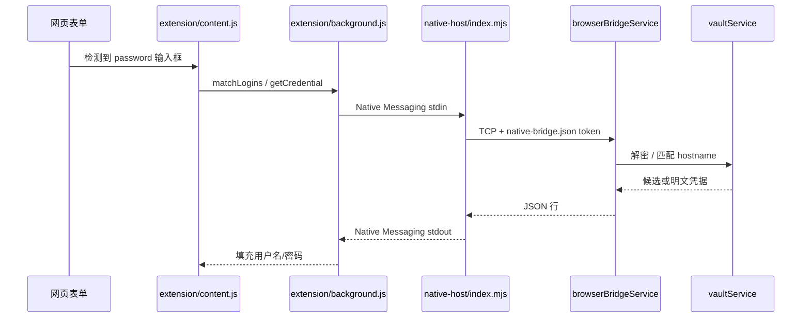

# 浏览器自动填充（v1.6.0）

Chrome / Edge 扩展 + Native Messaging Host + 主进程本地桥接。全程本机通信，无业务出站。

## 组件与目录

| 组件 | 路径 | 职责 |
|------|------|------|
| 浏览器扩展 | [`extension/`](../../extension/) | MV3：检测登录表单、填充 UI、`connectNative('com.pwdbook.app')` |
| Native Host | [`native-host/`](../../native-host/) | Chrome 子进程：stdio ↔ `127.0.0.1` 桥接（`index.mjs` + `pwdbook-native-host.cmd`） |
| 桥接服务 | [`browserBridgeService.ts`](../../src/main/services/browserBridgeService.ts) | `127.0.0.1` TCP，校验 token / 解锁 / URL |
| URL 匹配 | [`browserMatchService.ts`](../../src/main/services/browserMatchService.ts) | 按页面 hostname 匹配条目 |
| 注册 | [`nativeHostRegistryService.ts`](../../src/main/services/nativeHostRegistryService.ts) | 写清单 + Windows 注册表 |
| 协议类型 | [`browserBridgeProtocol.ts`](../../src/shared/browserBridgeProtocol.ts) | Bridge 请求/响应、注册状态 |
| URL 工具 | [`urlMatch.ts`](../../src/shared/urlMatch.ts) | `entryUrlMatchesPage`、`normalizeUrl` |

打包：`package.json` → `extraResources` 复制 `native-host/`、`extension/`；NSIS 见 [`deps/installer.nsh`](../../deps/installer.nsh)。

## 端到端数据流



## 主进程桥接（browserBridgeService）

- **启动**：`syncBrowserBridge()` — `app.whenReady` 与 `settings:update` 在 `browserFillEnabled === true` 时调用。
- **监听**：`127.0.0.1` 随机端口；写入 [`native-bridge.json`](../../src/main/services/browserBridgeService.ts)（路径：`{userData}/native-bridge.json`，并镜像一份到 `%APPDATA%/PwdBook/` 兼容旧 Host）。
- **配对**：`bridgeToken`（UUID）；每条 TCP 请求 JSON 须带相同 `token`。
- **动作**（[`browserBridgeProtocol.ts`](../../src/shared/browserBridgeProtocol.ts)）：

| action | 需解锁 | 说明 |
|--------|--------|------|
| `ping` | 否 | 版本探测 |
| `status` | 否 | `{ unlocked, entryCount }` |
| `matchLogins` | 是 | `{ pageUrl }` → `[{ id, title, username }]`，不含密码 |
| `getCredential` | 是 | `{ entryId, pageUrl }` → 校验 hostname 后返回密码；`touchEntry` |

- **断连**：socket `ECONNRESET` / `EPIPE` 已处理，避免拖垮主进程。

## Native Host（native-host/）

| 文件 | 说明 |
|------|------|
| `pwdbook-native-host.cmd` | Chrome 注册表 `path` 指向的入口，执行 `node index.mjs` |
| `index.mjs` | 读 4 字节长度 + JSON（Chrome 协议）→ 连 Bridge → 写回响应 |
| `com.pwdbook.app.json` | **仓库内仅为模板**（`REPLACE_EXTENSION_ID`），勿直接给浏览器用 |

**运行时有效清单**（注册后）：

```
%APPDATA%\pwd-book\native-host\com.pwdbook.app.json
```

注册表（当前用户）：

- `HKCU\Software\Google\Chrome\NativeMessagingHosts\com.pwdbook.app`
- `HKCU\Software\Microsoft\Edge\NativeMessagingHosts\com.pwdbook.app`

## 扩展（extension/）

| 文件 | 说明 |
|------|------|
| `manifest.json` | MV3；`nativeMessaging`、`activeTab`、`content_scripts` |
| `background.js` | `connectNative('com.pwdbook.app')` 转发 |
| `content.js` | 检测表单、PwdBook 填充条、自定义账号下拉（避免原生 select 触发 MutationObserver 重建） |
| `popup.js` | 连接状态（已连接 / 锁定 / BRIDGE_NOT_RUNNING 等） |
| `pwdbook-theme.css` | 与经典主题一致的配色变量 |

**扩展 ID**：未打包扩展从**固定目录路径**加载时 ID 稳定；与 `allowed_origins` 必须一致。

## 设置与注册（渲染进程）

[`SettingsView.vue`](../../src/components/SettingsView.vue) 安全页：

- 开关 `browserFillEnabled` → `settingsService` + `syncBrowserBridge()`
- 扩展 ID 输入 + **「注册到 Chrome / Edge」** → IPC `browser:register-native-host`
- **「打开扩展管理页」** → `shell:open-extensions-page`（`chrome://extensions/`）

命令行等价：`npm run register-native-host -- <扩展ID>`（[`scripts/register-native-host.mjs`](../../scripts/register-native-host.mjs)）。

## IPC 通道

| 通道 | 说明 |
|------|------|
| `browser:bridge-status` | `BrowserBridgeStatus` |
| `browser:bridge-regenerate-token` | 重建 token + 端口 |
| `browser:native-host-info` | `NativeHostRegistrationInfo` |
| `browser:register-native-host` | 参数：扩展 ID 字符串 |
| `shell:open-extensions-page` | 打开 Chrome 扩展管理页 |

## 数据库 / 设置键

| Key | 说明 |
|-----|------|
| `browser_fill_enabled` | 是否开启桥接（`SecuritySettings.browserFillEnabled`） |
| `browser_extension_id` | 上次注册使用的扩展 ID |

见 [database-schema.md](./database-schema.md)。

## URL 匹配规则

- 比较 **hostname**（`urlMatch.entryUrlMatchesPage`）。
- 条目 `url` 为空则不参与匹配。
- 多条命中按 `last_used_at` 降序；扩展 UI 供用户选择。

## 安全边界

| 层级 | 机制 |
|------|------|
| 网络 | 无云端；Bridge 仅 `127.0.0.1` |
| 解锁 | `matchLogins` / `getCredential` 需 `sessionKey` |
| 出密 | `getCredential` 校验 `entry.url` 与 `pageUrl` 同 hostname |
| 配对 | `native-bridge.json` 中的 `token` + Native Host 仅本机 |
| 扩展 | `allowed_origins` 仅允许指定 `chrome-extension://<id>/` |
| 日志 | 禁止打印 password |

## 用户操作摘要

1. 设置 → 安全：开启「浏览器自动填充」。
2. 加载 `extension/` 为已解压扩展，复制 ID。
3. 粘贴 ID → 注册 → **完全退出并重启浏览器**。
4. 保持 PwdBook 运行且已解锁，在登录页使用填充条。

## 故障排查

| 现象 | 检查 |
|------|------|
| `BRIDGE_NOT_RUNNING` | PwdBook 是否运行、开关是否开启、`%APPDATA%\pwd-book\native-bridge.json` 是否存在 |
| 请先解锁 | 主窗口解锁保险库 |
| Native 连不上 | 是否用设置页注册、ID 是否与 `chrome://extensions` 一致、是否重启浏览器 |
| 无填充条 | 页面是否有 `type=password`、条目 url 域名是否一致 |
| 主进程 ECONNRESET | 已修复；确保使用 v1.6.0+ 桥接代码 |

## 相关文档

- 用户指南：[README.md — 浏览器扩展](../../README.md#浏览器扩展chrome--edge)
- Native Host 说明：[native-host/README.md](../../native-host/README.md)
