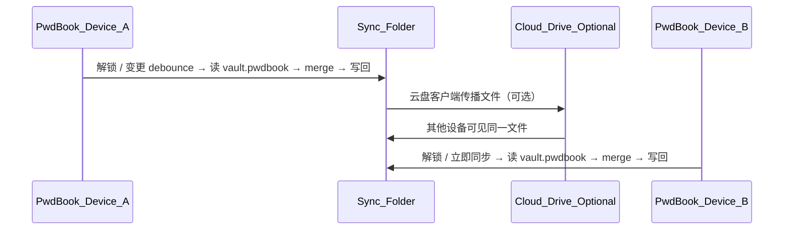

# 文件夹同步（v1.19.0）

PwdBook **v1.19.0** 起支持参考 Enpass 模式的 **文件夹同步（Folder Sync）**：用户选择本地目录（可位于 Dropbox、OneDrive、iCloud 等云盘同步文件夹内），在该目录读写加密 `vault.pwdbook`；云盘仅传播文件，加解密与合并在本机完成。

用户入口：**设置 → 数据 → 同步** → **文件夹同步**（`AppScreen = 'folder-sync'`）。

## 与 Wi-Fi 同步的关系

| 维度 | Wi-Fi 同步（v1.9.0） | 文件夹同步（v1.19.0） |
|------|----------------------|------------------------|
| 传输 | 局域网 HTTPS WebDAV + mDNS | 用户自选文件夹（可经云盘传播） |
| 同步包 | `vault.pwdbook`（AES 加密 SyncBundle） | **相同格式与文件名** |
| 合并策略 | `mergeSyncBundles` LWW | **相同** |
| 入口 | Sync Hub → 局域网同步 | Sync Hub → 文件夹同步 |
| 并存 | 两种方式独立配置，可只启用其一 | |

共享模块：`syncBundleService`、`syncMergeService`、`shared/syncMerge.ts`、`syncBundleCrypto.ts`。详见 [wifi-sync.md](./wifi-sync.md) 中 SyncBundle 格式与合并策略。

## 架构概览



| 层级 | 模块 | 说明 |
|------|------|------|
| 共享类型 | `src/shared/syncTypes.ts` | `FolderSyncSettings`、`FolderSyncStatus` |
| 合并（复用） | `src/shared/syncMerge.ts` | 与 Wi-Fi 同步相同 LWW 规则 |
| Bundle 服务（复用） | `src/main/services/syncBundleService.ts` | 构建/加密封包；`sync_revision` 等全局状态 |
| 合并落库（复用） | `src/main/services/syncMergeService.ts` | `mergeEncryptedRemoteBundle` |
| 文件夹同步 | `src/main/services/folderSyncService.ts` | 目录读写、连接/断开、自动与手动同步 |
| IPC | `src/main/ipc/handlers.ts` | `folder-sync:*` 通道；`dialog.showOpenDialog` 选目录 |

## 用户流程

### 首次连接

1. **设置 → 数据 → 同步 → 文件夹同步**
2. 点击 **选择同步文件夹** → 系统目录选择器（`openDirectory` + `createDirectory`）
3. 确认 **主密码**
4. 若目录已有 `vault.pwdbook` → 解密并与本地合并后写回；否则将本机数据写入该目录
5. 写入 `app_settings.folder_sync_settings`（`enabled: true`、`folderPath`、`autoSync: true`）

### 已连接

| 操作 | 行为 |
|------|------|
| **自动同步**（默认开启） | 保险库 persist 后 debounce **3s** → 读文件夹内包 → merge → 写回（使用会话传输密钥，无需再次输入主密码） |
| **解锁后** | `restoreFolderSyncOnUnlock()` → 立即执行一次与自动同步相同的 merge-write |
| **立即同步** | 须主密码确认 → `syncFolderNow` → merge-write |
| **更改文件夹** | 重新选目录 → 主密码确认 → `connectFolderSync`（等同新连接） |
| **断开连接** | 清除本地配置；**不删除**文件夹内 `vault.pwdbook` |

### 典型跨设备场景

各设备安装 PwdBook，**主密码一致**，在 Dropbox / OneDrive 等云盘中创建同一同步目录（或各端指向云盘已同步的相同路径），分别完成「选择同步文件夹」即可。云盘负责文件传播；PwdBook 负责解密、合并、重加密。

## 核心实现

### `publishMergedToFolder`

```text
readRemoteBundle(folderPath)
  ├─ 存在 → mergeEncryptedRemoteBundle(remote, transportKey)
  └─ 不存在 → publishEncryptedBundle(transportKey)（仅 bump revision）
buildSyncBundle(result.revision) → encrypt → writeRemoteBundle
```

- **手动连接/同步**：`deriveSyncTransportKey(masterPassword)`（用户输入主密码）
- **自动同步 / 解锁恢复**：`getSyncTransportKey()`（解锁时会话内已有）

### 与 Wi-Fi Server 自动发布的差异

Wi-Fi **服务端**在本地变更时通常 **直接发布本机 bundle**，不先读远端。文件夹同步在每次写入前 **先读文件夹内现有包再 merge**，避免多设备经云盘协作时覆盖他端修改。

## IPC 通道

| 通道 | 需解锁 | 说明 |
|------|--------|------|
| `folder-sync:get-settings` | 否 | `FolderSyncSettings` |
| `folder-sync:update-settings` | 否 | 部分更新（如 `autoSync`） |
| `folder-sync:status` | 否 | 连接状态、路径、`vault.pwdbook` 是否存在/大小/mtime |
| `folder-sync:pick-directory` | 否 | 打开系统文件夹选择器；取消返回 `null` |
| `folder-sync:connect` | 是 | 参数：`folderPath`、`masterPassword`；首次连接或更改目录 |
| `folder-sync:disconnect` | 否 | 断开连接，保留文件夹内文件 |
| `folder-sync:sync-now` | 是 | 参数：主密码；手动 merge-write |

共享同步状态（与 Wi-Fi 共用）：

| 通道 | 说明 |
|------|------|
| `sync:status` | `deviceId`、`revision`、`lastSyncedAt`、`lastSyncError` |

## UI 组件

| 文件 | 职责 |
|------|------|
| `SyncHubView.vue` | **v1.19.0** 同步方式选择：局域网同步 / 文件夹同步 |
| `FolderSyncView.vue` | 未连接引导、已连接路径与文件信息、自动同步开关、立即同步、教程 |
| `sync/SyncConflictModal.vue` | 合并冲突列表（与 Wi-Fi 共用） |

屏幕路由（`AppScreen`）：

| 值 | 视图 |
|----|------|
| `sync` | `SyncHubView.vue` |
| `wifi-sync` | `WifiSyncView.vue`（返回 Sync Hub） |
| `folder-sync` | `FolderSyncView.vue` |

`useAppState`：`openSync`、`openFolderSync`、`loadFolderSyncState`、`pickFolderSyncDirectory`、`connectFolderSync`、`disconnectFolderSync`、`updateFolderSyncAutoSync`、`syncFolderNow`。

## 持久化

### SQLite `app_settings`

| 键 | 说明 |
|----|------|
| `folder_sync_settings` | JSON：`enabled`、`folderPath`、`autoSync` |
| `sync_device_id` | 本机设备 UUID（与 Wi-Fi 共用） |
| `sync_revision` | 当前 SyncBundle 版本号（与 Wi-Fi 共用） |
| `sync_last_synced_at` | 上次成功 merge 时间戳（与 Wi-Fi 共用） |
| `sync_last_sync_error` | 最近一次同步错误（与 Wi-Fi 共用） |

### 用户选定目录（非 SQLite）

| 路径 | 说明 |
|------|------|
| `{用户选择的目录}/vault.pwdbook` | 加密 SyncBundle；文件名常量 `SYNC_BUNDLE_FILENAME` |

## 错误码

| 代码 | 含义 |
|------|------|
| `FOLDER_SYNC_NOT_CONFIGURED` | 未连接文件夹时调用 `sync-now` |
| `FOLDER_SYNC_PATH_REQUIRED` | 连接时路径为空 |
| `FOLDER_SYNC_PATH_INVALID` | 无法创建或访问所选目录 |

## 安全约束

- **云盘不接触明文**：文件夹内仅有 AES 加密的 `vault.pwdbook`。
- **主密码须一致**：传输密钥 `deriveSyncTransportKey(masterPassword)` 跨设备相同。
- **锁定不同步**：未解锁不 merge、不写入文件夹。
- **断开不删文件**：避免误删用户云盘中的备份。
- 保险库 persist 时：`database.ts` 同时调用 `notifyVaultChangedForSync()` 与 `notifyVaultChangedForFolderSync()`。

## 相关测试

```bash
npm test
```

文件夹同步复用既有 `syncMerge`、`syncBundleCrypto` 等测试；暂无独立 `folderSyncService` 单元测试（I/O 依赖 Electron `dialog` 与用户目录）。
