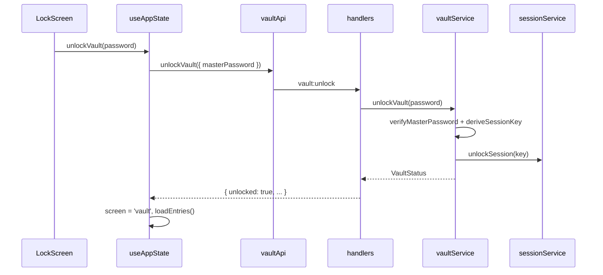
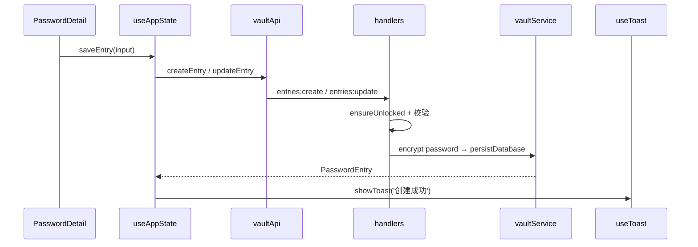
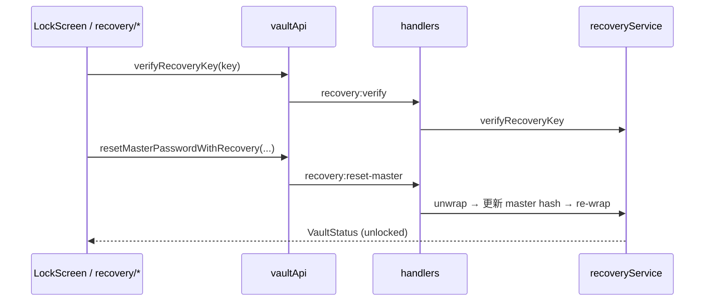

# IPC 与数据流

## IPC 通道一览

定义于 `src/shared/types.ts` 的 `IPC` 常量；主进程注册于 `handlers.ts`，preload 暴露于 `api.ts`。

### 保险库

| 通道 | 方向 | 说明 |
|------|------|------|
| `vault:status` | invoke | 返回 `VaultStatus` |
| `vault:setup` | invoke | 创建主密码 |
| `vault:unlock` | invoke | 解锁，派生 sessionKey |
| `vault:lock` | invoke | 锁定，清除 sessionKey |
| `vault:reset` | invoke |  wipe 数据库文件 |

### 恢复

| 通道 | 需解锁 | 说明 |
|------|--------|------|
| `recovery:status` | 否 | `{ configured: boolean }` |
| `recovery:verify` | 否 | 校验恢复密钥格式与 hash |
| `recovery:create` | 是 | 生成并返回明文 recoveryKey（仅一次） |
| `recovery:reset-master` | 否 | 恢复密钥 + 新主密码 |
| `recovery:clear` | 是 | 删除恢复密钥数据 |
| `recovery:regenerate` | 是 | 需当前主密码 |

### 条目

| 通道 | 需解锁 | 说明 |
|------|--------|------|
| `entries:list` | 是 | 解密后返回 `PasswordEntry[]` |
| `entries:create` | 是 | 校验 title/password 非空 |
| `entries:update` | 是 | 同上 |
| `entries:delete` | 是 | 按 id 删除 |
| `entries:toggle-favorite` | 是 | 切换收藏 |
| `entries:touch` | 是 | 更新 `last_used_at`，并写入快捷条 `quick_bar_recent_ids` |

### 快捷搜索条

| 通道 | 需解锁 | 说明 |
|------|--------|------|
| `quickbar:list-recent` | 是 | 返回快捷条「最近打开」条目（独立 ID 列表，最多 5） |
| `quickbar:remove-recent` | 是 | 从最近打开移除指定 id |

快捷条窗口控制为 `send` 通道（`quickbar:hide/show/resize/show-main`），详见 [quickbar-and-shortcuts.md](./quickbar-and-shortcuts.md)。

### 分类

| 通道 | 需解锁 | 说明 |
|------|--------|------|
| `categories:list` | 是 | 含 entryCount |
| `categories:create` | 是 | |
| `categories:update` | 是 | |
| `categories:delete` | 是 | 有条目时拒绝 |
| `categories:reorder` | 是 | 分类 sort_order |
| `categories:sidebar-order` | 否 | 读侧边栏顺序 |
| `categories:reorder-sidebar` | 是 | 写 sidebar_category_order |

### 设置与数据

| 通道 | 需解锁 | 说明 |
|------|--------|------|
| `settings:get` | 否 | `SecuritySettings` |
| `settings:update` | 否 | 部分更新；会重新注册全局快捷键（快捷条 + 主窗口）；同步 `browserBridgeService` |
| `clipboard:copy-secret` | 否 | 主进程写剪贴板 + 定时清除 |
| `data:export` | 是 | JSON 结构 `ExportPayload` |
| `data:import` | 是 | 批量导入条目 |

### 浏览器自动填充（v1.6.0）

| 通道 | 需解锁 | 说明 |
|------|--------|------|
| `browser:bridge-status` | 否 | 桥接是否运行、端口、是否已解锁 |
| `browser:bridge-regenerate-token` | 否 | 重新生成 `native-bridge.json` token |
| `browser:native-host-info` | 否 | 已注册扩展 ID、清单路径、Host 是否存在 |
| `browser:register-native-host` | 否 | 参数：32 位扩展 ID；写注册表 + 用户目录清单 |
| `shell:open-extensions-page` | 否 | 打开 `chrome://extensions/` |

扩展与主进程不经上述 IPC 直连，而是 **Native Host → TCP 桥接**。详见 [browser-autofill.md](./browser-autofill.md)。

### 窗口（非 IPC handle）

| 事件 | 方向 | 说明 |
|------|------|------|
| `window-minimize` | send | |
| `window-maximize` | send | |
| `window-close` | send | |
| `theme-set-native` | send | dark / light / system |

### 主进程 → 渲染进程事件（`IPC_EVENTS`）

| 事件 | 方向 | 说明 |
|------|------|------|
| `email-backup:scheduled-due` | send | 定时邮箱备份到期，弹出主密码确认 |
| `quickbar:shown` | send | 快捷条已显示 |
| `theme:changed` | send | 主题变更通知 |
| `session:system-lock` | send | **v1.8.0** 系统锁屏且已选「跟随系统锁屏」；主进程已 `lockVault()`，渲染进程同步 UI |

## 解锁流程

## 保存条目流程

失败时 `catch` → `parseErrorMessage` → Toast 显示具体原因（如「密码不能为空」）。

## 恢复主密码流程（锁定态）

## 安全边界

| 层级 | 机制 |
|------|------|
| Electron | `contextIsolation` + preload 白名单 API |
| 主进程 | 未解锁拒绝条目/分类 mutating IPC |
| 内存 | sessionKey 仅 `sessionService` 持有，锁定清零 |
| 磁盘 | 条目密码仅 `password_encrypted` 字段；主密码仅存 scrypt hash |
| 网络 | 无 outbound 业务请求 |
