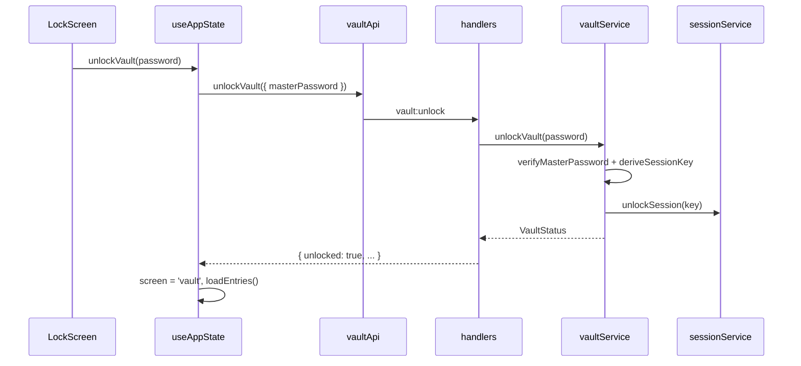
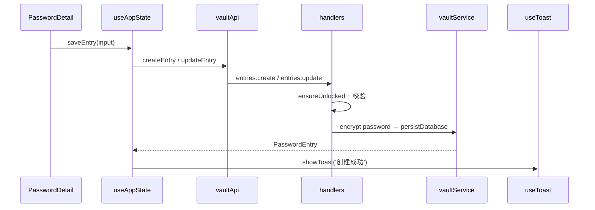
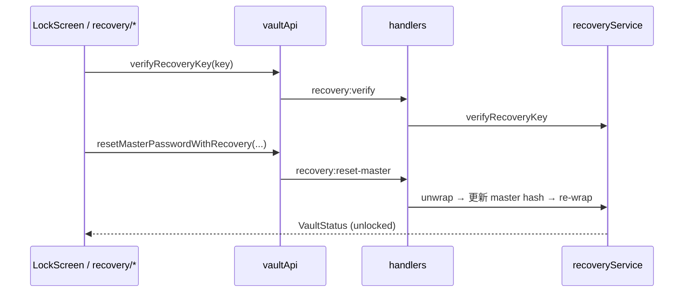

# IPC 与数据流

## IPC 通道一览

定义于 `src/shared/types.ts` 的 `IPC` 常量；主进程注册于 `handlers.ts`，preload 暴露于 `api.ts`。

### 保险库

| 通道 | 方向 | 说明 |
|------|------|------|
| `vault:status` | invoke | 返回 `VaultStatus` |
| `vault:setup` | invoke | 创建主密码 |
| `vault:unlock` | invoke | 解锁，派生 sessionKey |
| `vault:lock` | invoke | 锁定，清除 sessionKey |
| `vault:reset` | invoke |  wipe 数据库文件 |

### 恢复

| 通道 | 需解锁 | 说明 |
|------|--------|------|
| `recovery:status` | 否 | `{ configured: boolean }` |
| `recovery:verify` | 否 | 校验恢复密钥格式与 hash |
| `recovery:create` | 是 | 生成并返回明文 recoveryKey（仅一次） |
| `recovery:reset-master` | 否 | 恢复密钥 + 新主密码 |
| `recovery:clear` | 是 | 删除恢复密钥数据 |
| `recovery:regenerate` | 是 | 需当前主密码 |

### 条目

| 通道 | 需解锁 | 说明 |
|------|--------|------|
| `entries:list` | 是 | 解密后返回 `PasswordEntry[]` |
| `entries:create` | 是 | 校验 title/password 非空 |
| `entries:update` | 是 | 同上 |
| `entries:delete` | 是 | 按 id 删除 |
| `entries:toggle-favorite` | 是 | 切换收藏 |
| `entries:touch` | 是 | 更新 `last_used_at`，并写入快捷条 `quick_bar_recent_ids` |

### 快捷搜索条

| 通道 | 需解锁 | 说明 |
|------|--------|------|
| `quickbar:list-recent` | 是 | 返回快捷条「最近打开」条目（独立 ID 列表，条数由 `quickBarRecentLimit` 决定，默认 5、最大 20） |
| `quickbar:remove-recent` | 是 | 从最近打开移除指定 id |

快捷条窗口控制为 `send` 通道（`quickbar:hide/show/resize/show-main/focus-entry`），详见 [quickbar-and-shortcuts.md](./quickbar-and-shortcuts.md)。

### 分类

| 通道 | 需解锁 | 说明 |
|------|--------|------|
| `categories:list` | 是 | 含 entryCount |
| `categories:create` | 是 | |
| `categories:update` | 是 | |
| `categories:delete` | 是 | 有条目时拒绝 |
| `categories:reorder` | 是 | 分类 sort_order |
| `categories:sidebar-order` | 否 | 读侧边栏顺序 |
| `categories:reorder-sidebar` | 是 | 写 sidebar_category_order |

### 设置与数据

| 通道 | 需解锁 | 说明 |
|------|--------|------|
| `settings:get` | 否 | `SecuritySettings` |
| `settings:update` | 否 | 部分更新；会重新注册全局快捷键（快捷条 + 主窗口）；同步 `browserBridgeService`；变更 `launchAtLoginEnabled` 时同步 `launchAtLogin.ts`（**v1.21.0**） |
| `launch-at-login:available` | 否 | 是否可注册系统登录项（`app.isPackaged`，**v1.23.0**） |
| `clipboard:copy-secret` | 否 | 主进程写剪贴板 + 定时清除 |
| `data:export` | 是 | JSON 结构 `ExportPayload`（**v1.22.0** 含 `attachments`、`version: 2`） |
| `data:import` | 是 | 批量导入条目（**v1.22.0** 可含附件） |

### 条目附件（v1.22.0）

| 通道 | 需解锁 | 说明 |
|------|--------|------|
| `attachments:list` | 是 | 列出条目附件元数据 |
| `attachments:add` | 是 | 系统文件选择器添加附件 |
| `attachments:delete` | 是 | 删除附件及密文文件 |
| `attachments:open` | 是 | 解密到临时文件并用系统默认应用打开 |
| `attachments:save-as` | 是 | 解密并另存为 |

### 局域网同步（v1.9.0）

详见 [wifi-sync.md](./wifi-sync.md)。

| 通道 | 需解锁 | 说明 |
|------|--------|------|
| `sync:status` | 是 | 同步 revision、上次同步时间 |
| `sync:export-bundle` | 是 | 导出加密 SyncBundle |
| `sync:import-bundle` | 是 | 从加密 buffer 合并 |
| `wifi-sync:start-server` | 是 | 启动 HTTPS WebDAV + mDNS |
| `wifi-sync:stop-server` | 否 | 停止服务 |
| `wifi-sync:server-status` | 否 | 地址、校验码、运行状态 |
| `wifi-sync:pairing-info` | 否* | 配对 JSON（服务须运行） |
| `wifi-sync:pull-merge` | 是 | 客户端拉取、合并、回传 |
| `wifi-sync:discover` | 否 | mDNS 浏览局域网服务 |

### 文件夹同步（v1.19.0）

详见 [folder-sync.md](./folder-sync.md)。

| 通道 | 需解锁 | 说明 |
|------|--------|------|
| `folder-sync:get-settings` | 否 | `FolderSyncSettings` |
| `folder-sync:update-settings` | 否 | 部分更新（如 `autoSync`） |
| `folder-sync:status` | 否 | 连接状态、路径、bundle 文件信息 |
| `folder-sync:pick-directory` | 否 | 系统文件夹选择器 |
| `folder-sync:connect` | 是 | 选择目录 + 主密码，首次连接或改目录 |
| `folder-sync:disconnect` | 否 | 断开连接（不删文件夹内文件） |
| `folder-sync:sync-now` | 是 | 手动 merge-write |

### 浏览器自动填充（v1.6.0）

| 通道 | 需解锁 | 说明 |
|------|--------|------|
| `browser:bridge-status` | 否 | 桥接是否运行、端口、是否已解锁 |
| `browser:bridge-regenerate-token` | 否 | 重新生成 `native-bridge.json` token |
| `browser:native-host-info` | 否 | 已注册扩展 ID、清单路径、Host 是否存在 |
| `browser:register-native-host` | 否 | 参数：32 位扩展 ID；写注册表 + 用户目录清单 |
| `shell:open-extensions-page` | 否 | 打开 `chrome://extensions/` |

扩展与主进程不经上述 IPC 直连，而是 **Native Host → TCP 桥接**。详见 [browser-autofill.md](./browser-autofill.md)。

### 详情小窗口（v1.14.0）

| 通道 | 需解锁 | 说明 |
|------|--------|------|
| `detail-window:open` | 是 | 打开/聚焦小窗口并选中条目 id |
| `detail-window:close` | 否 | 关闭小窗口 |
| `detail-window:ready` | 否 | 小窗口渲染就绪；主进程下发待选条目 |
| `detail-window:select-entry` | 是* | 主窗口切换选中时同步至已打开的小窗口（sender 须为主窗口） |
| `detail-window:get-always-on-top` | 否* | 查询小窗口置顶状态（sender 须为小窗口；**v1.20.0** 起推荐 `window:get-always-on-top`） |
| `detail-window:toggle-always-on-top` | 否* | 切换小窗口置顶（sender 须为小窗口；**v1.20.0** 起推荐 `window:toggle-always-on-top`） |
| `vault-data:notify-changed` | 否 | 任一侧保存后通知主进程广播 `vault-data:changed` |

### 窗口置顶（v1.20.0）

| 通道 | 需解锁 | 说明 |
|------|--------|------|
| `window:get-always-on-top` | 否 | 查询 **sender 所在窗口** 是否 `isAlwaysOnTop()` |
| `window:toggle-always-on-top` | 否 | 切换 sender 窗口置顶（`setAlwaysOnTop(next, 'floating')`） |

主窗口与详情小窗口 `TitleBar.vue` 均调用上述通道；小窗口仍保留 `detail-window:*` 兼容实现。

### 窗口最大化状态（v1.23.0）

| 通道 | 需解锁 | 说明 |
|------|--------|------|
| `window:get-maximized` | 否 | 查询 sender 所在窗口是否 `isMaximized()` |

| 事件 | 方向 | 说明 |
|------|------|------|
| `window:maximize-changed` | send | 主窗口最大化/还原时广播 `boolean`；`TitleBar` 切换最大化/还原图标 |

### 窗口（非 IPC handle）

| 事件 | 方向 | 说明 |
|------|------|------|
| `window-minimize` | send | |
| `window-maximize` | send | |
| `window-close` | send | |
| `theme-set-native` | send | dark / light / system |

### 主进程 → 渲染进程事件（`IPC_EVENTS`）

| 事件 | 方向 | 说明 |
|------|------|------|
| `email-backup:scheduled-due` | send | 定时邮箱备份到期，弹出主密码确认 |
| `quickbar:shown` | send | 快捷条已显示 |
| `quickbar:focus-entry` | send | **v1.26.0** 快捷条网站条目：主进程显示主窗口后广播 entryId，渲染进程 `focusEntryFromQuickBar` |
| `theme:changed` | send | 主题变更通知 |
| `session:system-lock` | send | **v1.8.0** 系统锁屏且已选「跟随系统锁屏」；主进程已 `lockVault()`，渲染进程同步 UI |
| `detail-window:select-entry` | send | **v1.14.0** 主/小窗口切换选中条目 |
| `detail-window:opened` | send | **v1.14.0** 小窗口已打开（主窗口收起内联详情位） |
| `detail-window:closed` | send | **v1.14.0** 小窗口已关闭（主窗口恢复内联详情） |
| `vault-data:changed` | send | **v1.14.0** 保险库数据变更，各窗口 `refreshVaultData` |
| `tray:open-settings` | send | **v1.23.0** 托盘菜单「设置」；渲染进程 `openSettingsFromTray()` |
| `window:maximize-changed` | send | **v1.23.0** 主窗口最大化状态变更（见上表） |

## 解锁流程

## 保存条目流程

失败时 `catch` → `parseErrorMessage` → Toast 显示具体原因（如「密码不能为空」）。

### 错误传播（v1.18.0）

主进程 `handlers.ts` 中 `wrap()` 及各 `ipcMain.handle` 的 `catch` 块以 `throw new Error(message, { cause: error })` 重抛；Preload `api.ts` 的 `invoke()` 同样在解析失败时保留 `cause`。渲染进程仍通过 `parseErrorMessage` 提取用户可见文案，开发调试可在 DevTools 展开 `error.cause` 查看原始堆栈。

## 恢复主密码流程（锁定态）

## 安全边界

| 层级 | 机制 |
|------|------|
| Electron | `contextIsolation` + preload 白名单 API |
| 主进程 | 未解锁拒绝条目/分类 mutating IPC |
| 内存 | sessionKey 仅 `sessionService` 持有，锁定清零 |
| 磁盘 | 条目密码仅 `password_encrypted` 字段；主密码仅存 scrypt hash |
| 网络 | 无 outbound 云业务；Wi-Fi 同步仅 LAN WebDAV（v1.9.0）；文件夹同步由用户自选目录/云盘传播加密文件（v1.19.0） |
