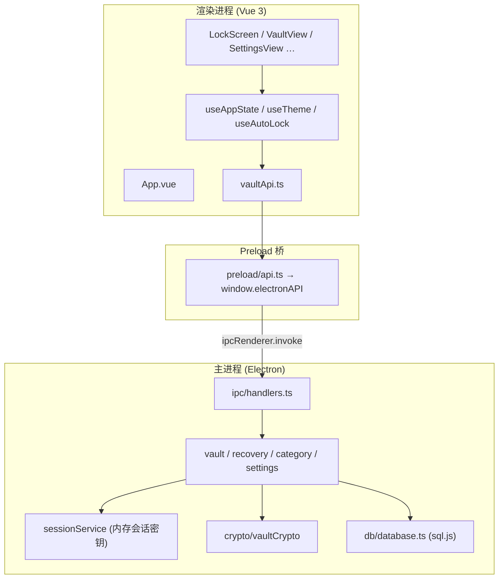

# 架构概览

## Executive Summary

PwdBook 是一款 **Electron 35 + Vue 3 + TypeScript** 本地密码管理桌面应用。数据存于本机 SQLite 文件（sql.js WASM），不上传云端。主密码经 scrypt 校验；解锁后会话密钥用于 AES-256-GCM 加密条目密码；锁定后清除内存中的会话密钥。

| 指标 | 值 |
|------|-----|
| 版本 | 1.3.0（`package.json`） |
| 源码文件 | ~60+ 个 `.ts` / `.vue`（`src/`） |
| IPC 通道 | 30+ 个（`src/shared/types.ts` → `IPC` + 快捷条事件） |
| 测试 | 暂无自动化测试套件 |

## 三层进程模型



## 入口点

| 入口 | 路径 | 职责 |
|------|------|------|
| 主进程 bootstrap | `src/main/index.ts:35` | 初始化 DB、注册 IPC、创建无边框窗口 |
| Preload 暴露 | `src/preload/index.ts` | 将 `electronAPI` 挂到 `window` |
| 渲染入口 | `src/renderer/app.ts` | 挂载 Vue 根组件 `App.vue` |
| 应用状态中枢 | `src/composables/useAppState.ts` | 屏幕路由、保险库 CRUD、分类、设置 |
| IPC 注册 | `src/main/ipc/handlers.ts:77` | 全部 `ipcMain.handle` |

## 屏幕状态机

`useAppState` 用 `screen: AppScreen` 驱动根视图切换：

```
lock ──unlock──► vault ◄──► settings
  ▲                  │
  └──── lock ────────┘
```

- **lock**：`LockScreen.vue` — 创建/解锁/恢复密钥/清除保险库
- **vault**：`VaultView.vue` — 侧边栏 + 列表 + 详情
- **settings**：`SettingsView.vue` — 安全、外观、数据、关于

## 目录结构

```
src/
├── main/                 # Electron 主进程
│   ├── index.ts          # 窗口与 app 生命周期
│   ├── ipc/handlers.ts   # IPC 路由与校验
│   ├── crypto/           # scrypt + AES-256-GCM
│   ├── db/               # sql.js 初始化、迁移、helpers
│   └── services/         # 业务逻辑（vault、recovery、category、settings、session）
├── preload/
│   ├── index.ts          # contextBridge 暴露
│   └── api.ts            # typed IPC 封装
├── renderer/
│   └── app.ts            # Vue createApp
├── components/           # UI 组件（含 recovery/ 子目录）
├── composables/          # useAppState、useTheme、useAutoLock、useToast
├── services/
│   └── vaultApi.ts       # 渲染层 API 门面
├── shared/
│   ├── types.ts          # 共享类型 + IPC 常量
│   ├── utils.ts          # 格式化、错误解析、密码生成
│   └── categoryIcons.ts  # 分类/条目图标注册表
└── assets/styles/        # tokens.css、global.css
```

## 外部依赖

| 依赖 | 用途 | 关键性 |
|------|------|--------|
| `electron` | 桌面壳、IPC、剪贴板 | 高 |
| `vue` | UI 框架 | 高 |
| `sql.js` | 本地 SQLite（WASM） | 高 |
| `lucide-vue-next` | 图标 | 中 |
| Node `crypto` | scrypt、AES-GCM | 高 |

## 配置与数据路径

| 来源 | 说明 |
|------|------|
| `app.getPath('userData')/pwdbook.db` | 数据库文件（Windows: `%APPDATA%/pwd-book/`） |
| `app_settings` 表 | 主密码哈希、恢复密钥元数据、安全设置、侧边栏排序 |
| 无 `.env` | 应用不读取环境变量配置 |

## 构建产物

`npm run build` → `out/main`、`out/preload`、`out/renderer`（electron-vite）。
