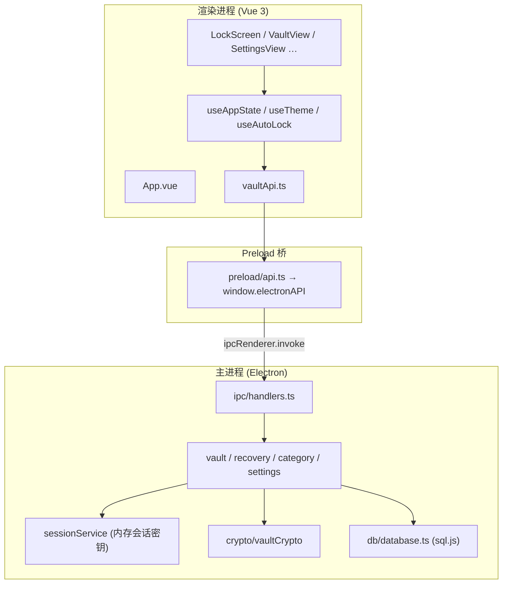

# 架构概览

## Executive Summary

PwdBook 是一款 **Electron 35 + Vue 3 + TypeScript** 本地密码管理桌面应用。数据存于本机 SQLite 文件（sql.js WASM），不上传云端。主密码经 scrypt 校验；解锁后会话密钥用于 AES-256-GCM 加密条目密码；锁定后清除内存中的会话密钥。

| 指标 | 值 |
|------|-----|
| 版本 | 1.33.0（`package.json`） |
| 源码文件 | ~75+ 个 `.ts` / `.vue`（`src/`）+ `extension/` + `native-host/` |
| IPC 通道 | 50+ 个（`src/shared/types.ts` → `IPC` + 快捷条 / 详情小窗口事件） |
| 测试 | Vitest：`syncMerge`、`syncBundleCrypto`、`totp`、`passwordHealth`、`recoveryKey`、`entrySearch`、`quickBarLimits`、`launchEntry`、`presetIcons` 等 |

## 三层进程模型



## 入口点

| 入口 | 路径 | 职责 |
|------|------|------|
| 主进程 bootstrap | `src/main/index.ts:35` | 初始化 DB、注册 IPC、创建无边框窗口 |
| Preload 暴露 | `src/preload/index.ts` | 将 `electronAPI` 挂到 `window` |
| 渲染入口 | `src/renderer/app.ts` | 挂载 Vue 根组件 `App.vue` |
| 详情小窗口入口 | `src/renderer/detail.ts` | 挂载 `DetailWindowApp.vue`（`detail.html`，v1.14.0） |
| 剪切板小窗口入口 | `src/renderer/clipboard-window.ts` | 挂载 `ClipboardWindowApp.vue`（`clipboard-window.html`，v1.32.0） |
| 应用状态中枢 | `src/composables/useAppState.ts` | 屏幕路由、保险库 CRUD、分类、设置 |
| IPC 注册 | `src/main/ipc/handlers.ts:77` | 全部 `ipcMain.handle` |

## 屏幕状态机

`useAppState` 用 `screen: AppScreen` 驱动根视图切换：

```
lock ──unlock──► vault ◄──► settings / email-backup / sync / wifi-sync / folder-sync / …
  ▲                  │
  └──── lock ────────┘
```

- **lock**：`LockScreen.vue` — 创建/解锁/恢复密钥/清除保险库
- **vault**：`VaultView.vue` — 侧边栏 + 列表 + 详情
- **settings**：`SettingsView.vue` — 安全、剪切板、浏览器、悬浮条、回收站、外观、数据、关于（**v1.33.0** 分区）
- **sync**：`SyncHubView.vue` — 同步方式选择（v1.19.0，入口：设置 → 数据 → 同步）
- **wifi-sync**：`WifiSyncView.vue` — 局域网同步（v1.9.0，经 Sync Hub 进入）
- **folder-sync**：`FolderSyncView.vue` — 文件夹同步（v1.19.0，经 Sync Hub 进入）
- **password-health**：`PasswordHealthView.vue` — 密码健康分析（v1.12.0，入口：侧栏工具与设置）

## 目录结构

```
src/
├── main/                 # Electron 主进程
│   ├── index.ts          # 窗口与 app 生命周期
│   ├── ipc/handlers.ts   # IPC 路由与校验
│   ├── crypto/           # scrypt + AES-256-GCM
│   ├── db/               # sql.js 初始化、迁移、helpers
│   ├── clipboardWindow.ts # 剪切板历史小窗口（v1.32.0）
│   └── services/         # vault、recovery、category、settings、sync*、wifiSync、folderSync、browserBridge、attachment*（v1.22.0）
├── extension/            # Chrome/Edge MV3（v1.6.0）
├── native-host/          # Native Messaging Host（v1.6.0）
├── preload/
│   ├── index.ts          # contextBridge 暴露
│   └── api.ts            # typed IPC 封装
├── renderer/
│   ├── app.ts            # Vue createApp
│   ├── detail.ts         # 详情小窗口（v1.14.0）
│   └── clipboard-window.ts # 剪切板历史小窗口（v1.32.0）
├── components/           # UI 组件（含 recovery/ 子目录）
├── composables/          # useAppState、useTheme、useAutoLock、useToast、useProductTour（v1.24.0）
├── services/
│   └── vaultApi.ts       # 渲染层 API 门面
├── shared/
│   ├── types.ts          # 共享类型 + IPC 常量
│   ├── syncTypes.ts      # SyncBundle、Wi-Fi 同步类型（v1.9.0）
│   ├── syncMerge.ts      # LWW 合并纯函数
│   ├── totp.ts           # TOTP 生成与 Base32 校验（v1.12.0）
│   ├── passwordHealth.ts # 弱密码 / 重复密码分析（v1.12.0）
│   ├── recoveryKey.ts    # 恢复密钥格式校验（v1.12.0）
│   ├── trayLabels.ts     # 托盘菜单文案（v1.12.0）
│   ├── syncClient.ts     # WebDAV 客户端传输
│   ├── browserBridgeProtocol.ts  # 浏览器桥接协议（v1.6.0）
│   ├── urlMatch.ts       # 条目 URL / 页面 hostname 匹配
│   ├── utils.ts          # 格式化、错误解析、密码生成
│   └── categoryIcons.ts  # 分类/条目图标注册表
└── assets/styles/        # tokens.css、global.css
```

## 外部依赖

| 依赖 | 用途 | 关键性 |
|------|------|--------|
| `electron` | 桌面壳、IPC、剪贴板 | 高 |
| `vue` | UI 框架 | 高 |
| `sql.js` | 本地 SQLite（WASM） | 高 |
| `bonjour-service` | Wi-Fi 同步 mDNS（v1.9.0） | 中 |
| `qrcode` | 配对二维码（v1.9.0） | 低 |
| `lucide-vue-next` | 图标 | 中 |
| `vitest` | 单元测试 | 中 |
| Node `crypto` | scrypt、AES-GCM | 高 |

## 配置与数据路径

| 来源 | 说明 |
|------|------|
| `app.getPath('userData')/pwdbook.db` | 数据库文件（Windows: `%APPDATA%/pwd-book/`；macOS: `~/Library/Application Support/pwd-book/`） |
| `app_settings` 表 | 主密码哈希、恢复密钥元数据、安全设置、侧边栏排序 |
| 无 `.env` | 应用不读取环境变量配置 |

## 构建产物

`npm run build` → `out/main`、`out/preload`、`out/renderer`（electron-vite）。

### 安装包（electron-builder）

| 命令 | 平台 | 产物 |
|------|------|------|
| `npm run dist:win` | Windows x64 | `release/PwdBook-{version}-Setup.exe`（NSIS） |
| `npm run dist:win:dir` | Windows x64 | `release/win-unpacked/` |
| `npm run dist:mac` | macOS x64 + arm64 | `release/PwdBook-{version}-{arch}.dmg`（v1.10.0） |
| `npm run dist:mac:dir` | macOS | `release/mac/` 或 `release/mac-arm64/` 下的 `.app` |
| `npm run dist:linux` | Linux x64 | `release/PwdBook-{version}.AppImage` |

macOS / Windows 当前未配置代码签名（Windows `signAndEditExecutable: false`）；分发时目标机器可能提示 SmartScreen / Gatekeeper。

### GitHub Release CI

推送匹配 `v*` 的 tag（如 `v1.27.0`）会触发 `.github/workflows/release.yml`：并行构建 Windows / Linux / macOS，并创建或更新对应 GitHub Release。Release 资产为：

- Windows：`PwdBook-{version}-Setup.zip`（内含 NSIS `Setup.exe`）
- Linux：`PwdBook-{version}.AppImage`
- macOS：`PwdBook-{version}-x64.dmg`、`PwdBook-{version}-arm64.dmg`

旧标签名 `release-v*` **不会**触发该 workflow。
