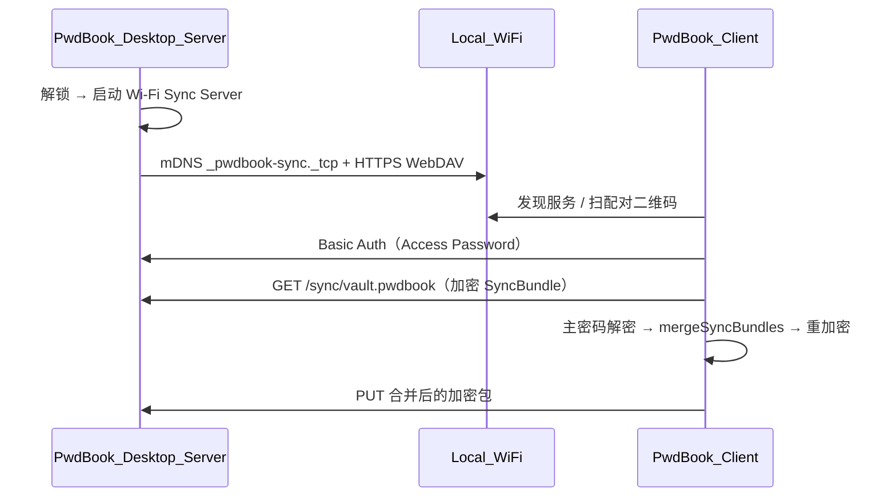

# Wi-Fi 局域网同步（v1.9.0）

PwdBook **v1.9.0** 起支持参考 Enpass 模式的 **局域网同步**：桌面作 **Server**，其他设备作 **Client**，数据不经互联网，传输层为 HTTPS WebDAV + mDNS 发现，同步包全程主密码加密。

用户入口：**设置 → 数据 → 同步** → **局域网同步**（`AppScreen = 'wifi-sync'`）。**v1.19.0** 起先进入 Sync Hub（`AppScreen = 'sync'`）再选择本方式。

## 架构概览



| 层级 | 模块 | 说明 |
|------|------|------|
| 共享类型 | `src/shared/syncTypes.ts` | `SyncBundle`、`WifiSyncSettings`、配对与状态类型 |
| 合并（纯函数） | `src/shared/syncMerge.ts` | 按 `entry.id` + `updated_at` LWW；分类按 id/名称合并 |
| 校验码 | `src/shared/syncVerification.ts` | 基于证书指纹 + 30s 时间窗的 6 位 HMAC 码 |
| 传输 | `src/shared/syncClient.ts` | WebDAV GET/PUT、`parsePairingPayload` |
| 移动端工作流 | `src/shared/mobileSyncWorkflow.ts` | 可注入 transport/crypto 的 pull-merge-push（供未来移动端复用） |
| 加密封包 | `src/main/crypto/syncBundleCrypto.ts` | AES-256-GCM，`SYNC_MAGIC = PBKS` |
| Bundle 服务 | `src/main/services/syncBundleService.ts` | 构建/发布/读取加密包；`sync_revision` 等状态 |
| 合并落库 | `src/main/services/syncMergeService.ts` | 解密远端 → 合并 → 本地重加密写入 DB |
| Wi-Fi Server | `src/main/services/wifiSyncService.ts` | HTTPS WebDAV、mDNS、配对信息、自动重建包 |
| Client（桌面） | `src/main/services/syncClientService.ts` | 发现、拉取、合并、回传；更新 `pairedDevices` |

## SyncBundle 格式

磁盘/网络上的文件名为 `vault.pwdbook`（`SYNC_BUNDLE_FILENAME`），内容为 **AES-256-GCM 加密的 JSON**：

```json
{
  "format": "pwdbook-sync",
  "version": 1,
  "deviceId": "uuid",
  "revision": 42,
  "exportedAt": "ISO8601",
  "categories": [],
  "entries": [],
  "settings": { "trashRetentionDays": 30 }
}
```

- **不传输** `master_salt` / 各设备独立的 `password_encrypted` 形态；合并后在本地用会话密钥重新加密条目。
- 传输密钥：`deriveSyncTransportKey(masterPassword)`（跨设备一致）。

## 合并策略（MVP）

| 场景 | 规则 |
|------|------|
| 仅一侧有条目 | 插入到合并结果 |
| 同 `id`，`updated_at` 不同 | 较新者胜（`deleted_at` 参与有效时间） |
| 同 `id`、同时间戳、内容不同 | 记入 `conflicts`，默认保留本地 |
| 分类同名不同 id | 保留本地 id，跳过远端重复名称 |

单元测试：`src/shared/syncMerge.test.ts`、`src/main/crypto/syncBundleCrypto.test.ts` 等。

## Server 模式（桌面）

| 能力 | 实现 |
|------|------|
| WebDAV | 最小实现：OPTIONS / GET / PUT / PROPFIND |
| HTTPS | 自签证书，存 `{userData}/wifi-sync-certs/` |
| mDNS | `bonjour-service`，类型 `pwdbook-sync`（`_pwdbook-sync._tcp`） |
| 鉴权 | 随机 Access Password；Basic Auth 用户名为 `pwdbook` |
| 配对 | JSON + **二维码**（`qrcode` 库）；含 host/port/accessPassword/fingerprint/verificationCode |
| 校验码 | `getSyncVerificationCode(fingerprint)`，每 30s 轮换 |
| 自动发布 | 保险库变更 debounce 3s → `publishEncryptedBundle` |
| 恢复服务 | 解锁后若 `serverEnabled` 为 true → `restoreWifiSyncServerIfNeeded()` |

暴露路径：`/sync/vault.pwdbook`（`SYNC_WEBDAV_PATH`）。

## Client 模式

桌面端可作为 Client（双桌面互相同步的 MVP）：

1. mDNS 发现局域网内的 PwdBook Server
2. 选择服务 → 显示本机计算的**校验码**供与桌面对照
3. 输入 Access Password → **立即同步**（须主密码确认）
4. 或折叠区 **手动粘贴配对 JSON** / 扫码内容

流程：`fetchRemoteEncryptedBundle` → `mergeEncryptedRemoteBundle` → `buildSyncBundle` → `pushRemoteEncryptedBundle`。

## IPC 通道

| 通道 | 需解锁 | 说明 |
|------|--------|------|
| `sync:status` | 是 | `deviceId`、`revision`、`lastSyncedAt` |
| `sync:export-bundle` | 是 | 导出加密 SyncBundle（文件拷贝测试用） |
| `sync:import-bundle` | 是 | 从加密 buffer 合并 |
| `wifi-sync:get-settings` | 否 | `WifiSyncSettings`（含 `pairedDevices`） |
| `wifi-sync:update-settings` | 否 | 部分更新 |
| `wifi-sync:start-server` | 是 | 启动 HTTPS + mDNS |
| `wifi-sync:stop-server` | 否 | 停止服务 |
| `wifi-sync:server-status` | 否 | 运行状态、地址、校验码等 |
| `wifi-sync:pairing-info` | 否* | 配对 JSON（*服务须运行） |
| `wifi-sync:regenerate-access-password` | 否 | 重新生成访问密码 |
| `wifi-sync:get-verification-code` | 否 | 按指纹计算客户端校验码 |
| `wifi-sync:discover` | 否 | mDNS 浏览 |
| `wifi-sync:pull-merge` | 是 | Client 拉取合并回传 |
| `wifi-sync:pull-merge-qr` | 是 | 从配对 JSON 同步 |

## UI 组件

| 文件 | 职责 |
|------|------|
| `WifiSyncView.vue` | 侧栏「我是服务端 / 我是客户端」；主区角色专属教程 + 操作 |
| `sync/SyncTutorialPanel.vue` | 按角色展示 3 步指引 + 示意图高亮 |
| `sync/SyncTutorialDiagram.vue` | GSAP 动画拓扑图 |
| `sync/SyncPairingQr.vue` | 配对 JSON 二维码 |
| `sync/SyncConflictModal.vue` | 同步冲突列表弹窗（v1.12.0；LWW 时间戳相同时保留本地） |

**冲突检测**（v1.12.0）：`mergeSyncBundles` 在本地与远端 `updated_at` 相同且内容不一致时记入 `conflicts[]`；`WifiSyncView` 在 `pullWifiSyncMerge` 成功后若有冲突则打开 `SyncConflictModal`。

`useAppState`：`openWifiSync`、`loadWifiSyncState`、`startWifiSyncServer`、`pullWifiSyncMerge` 等。

## 运行时文件（非 SQLite）

| 路径 | 说明 |
|------|------|
| `{userData}/sync-server/vault.pwdbook` | Server 对外提供的加密同步包 |
| `{userData}/wifi-sync-certs/server.key` / `server.crt` | 自签 TLS 材料 |
| `app_settings.wifi_sync_settings` | JSON：`serverEnabled`、`accessPassword`、`port`、`pairedDevices` |
| `app_settings.sync_device_id` | 本机同步设备 UUID |
| `app_settings.sync_revision` | 当前同步包版本号 |
| `app_settings.sync_last_synced_at` | 上次成功同步时间戳 |
| `app_settings.sync_last_sync_error` | 最近一次错误信息 |

## 安全约束

- **默认不联网**：同步仅绑定局域网；WebDAV 上只有加密包。
- **Access Password** 防止 LAN 内未授权读取；**校验码** 供用户肉眼防 MITM。
- **主密码必须一致**，否则无法解密合并。
- **锁定不同步**：未解锁不构建明文 bundle、不执行 merge。
- 条目变更触发 `notifyVaultChangedForSync()`（`database.ts` persist 钩子）；**v1.19.0** 起文件夹同步另触发 `notifyVaultChangedForFolderSync()`，见 [folder-sync.md](./folder-sync.md)。

## 相关测试

```bash
npm test
```

覆盖：`syncMerge`、`syncBundleCrypto`、`syncVerification`、`syncClient`、`mobileSyncWorkflow`。
